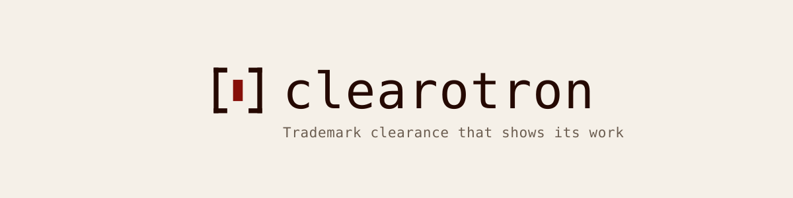
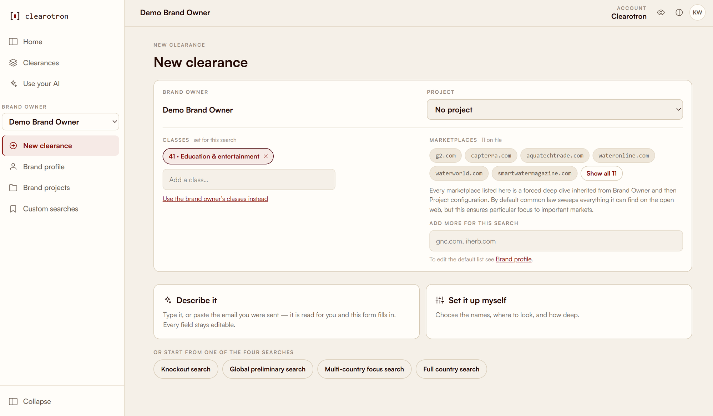
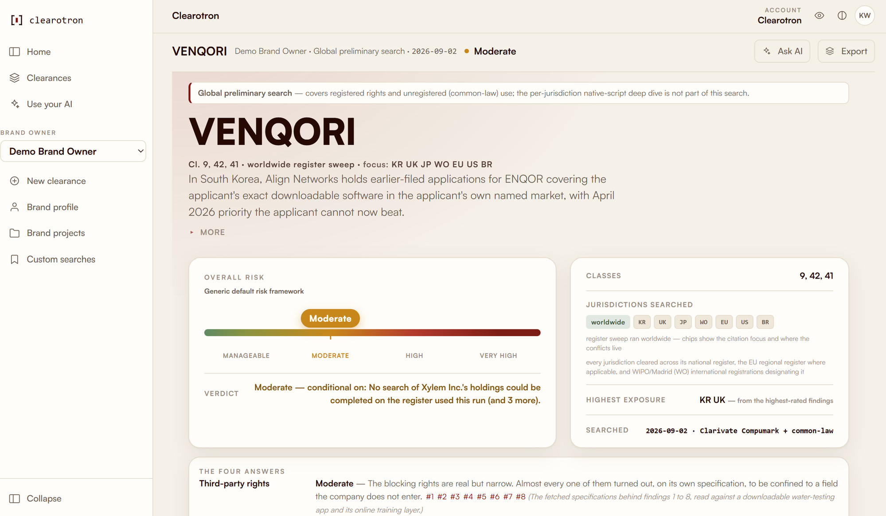
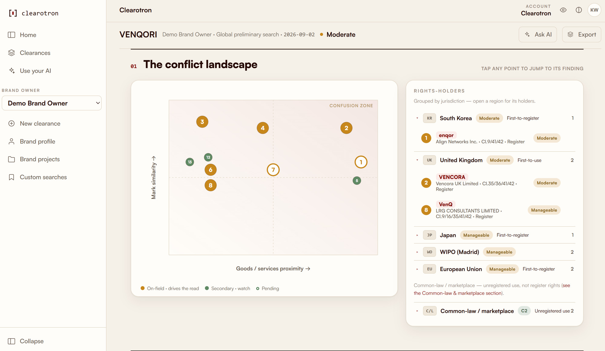

<p align="center">
  <picture>
    <source media="(prefers-color-scheme: dark)" srcset="docs/assets/clearotron-banner-dark.svg">
    
  </picture>
</p>

<p align="center">
  <a href="LICENSE"></a>
  <a href=".nvmrc"></a>
</p>

Give it a mark, its classes and a territory. Clearotron searches the trademark registers and the open
web for conflicts, reasons about the risk the way a clearance lawyer would, and publishes a written
report with a machine-readable audit trail behind every finding. It runs headless on your own machine:
no gateway, no platform, and nothing about your matters reaches us.

[Install & operate](INSTALL.md) · [Docs](docs/README.md) · [Security](docs/SECURITY.md) · [Contributing](CONTRIBUTING.md) · [Licence](#licence)

## Install

**See it work first, with nothing checked out.**

```bash
npx clearotron demo
```

That fetches the published package — it will ask once before downloading — then replays a finished
clearance into a local pool and opens the report in your browser. No account, no credentials, no network
calls to us.

**Then install it.**

```bash
npm install -g clearotron
```

Node 22 or newer, on macOS, Linux, or Windows via WSL2. That puts `clearotron` on your `PATH`; every
command below works in that short form.

**Or run it from source**, which is what you want if you intend to change it:

```bash
git clone https://github.com/CordilleraSarl/Clearotron
cd clearotron
npm install                    # every workspace
npm run build -w portal-ui     # the browser bundle is not committed — build it once
```

From a clone the commands are `npx clearotron …`, run from that directory.

## Quick start

Check the install before it does anything. `doctor` only reads — it writes nothing, calls nobody, and
names whatever is still missing:

```bash
npx clearotron doctor
```

Then start the product and open the portal it prints:

```bash
npx clearotron start
```

That is the portal a brand owner uses. Ordering a clearance is the same screen — describe it in a
sentence, or set the classes, marketplaces and search depth yourself:



A finished clearance reads like this — the verdict, the risk band and the four answers. **The mark
VENQORI is invented; the EUIPO register data behind it is real and live**, and the report says so on
its own face:



The conflict landscape places every finding by mark similarity and goods proximity, and lists the
rights-holders behind them by jurisdiction:



Then run your own. `install` asks one question at a time and checks each credential before it saves it:

```bash
npx clearotron install
npx clearotron run --job my-job.json
```

## How it fits together

- **A reasoning CLI does the thinking.** Every stage runs as a headless turn of the [Claude CLI](https://claude.com/claude-code) (`claude`) or the Codex CLI (`codex`), installed and signed in. An `ANTHROPIC_API_KEY` is not a substitute: the key decides what the child process is handed, not whether one is spawned.
- **One register credential sets coverage and cost.** `CLEAROTRON_DATABASE` has no default — a run refuses rather than picking a vendor for you. EUIPO and a local USPTO index cost nothing; Signa, Clarivate and Corsearch are subscriptions. [The six, and what each reaches](providers/README.md).
- **One research key.** `PERPLEXITY_API_KEY` covers the open web and the marketplaces. A clearance refuses without it at the door, before a register stage has spent.
- **A run takes hours, and survives interruption.** Every finished stage stays on disk; a resume re-runs only what is missing, and a run parked on a provider cap continues by itself.
- **A finished run is queryable.** An MCP server lets Claude, ChatGPT or your editor read and question
  any completed run in plain language: a trusted local **stdio** face, and an authenticated
  **HTTP** face whose read tools serve a signed-in identity while its write verbs — `start_run`
  among them, which spends — need an ops token. [Connect it](mcp-server/CONNECT.md).
- **The engine is not coupled to a vendor.** [`driver/register-plan.mjs`](driver/register-plan.mjs) — which decides what gets searched — takes a capabilities object as a parameter and imports no provider at all. An unknown register id throws rather than falling back.

## Security

Reports carry client matter. Treat the pool, the archive and the delivery packets as you would a case file.

**The authors of this software receive nothing** — no marks, no client context, no results, no usage
reports, no crash reports. There is no telemetry in this tree and no endpoint we control: every
destination is a register, a reasoning provider or a search provider you configured with your own
credential.
[What leaves the machine, call by call](docs/architecture/09-security-and-data.md#what-leaves-the-machine)
· [Security model](docs/SECURITY.md) · [Report a vulnerability](SECURITY.md).

## Documentation

| Goal | Start here |
|---|---|
| Install, configure and operate it | [INSTALL.md](INSTALL.md) |
| Pick a register, or run without a paid vendor | [INSTALL.md § 3a](INSTALL.md#3a-running-without-a-paid-register-vendor) |
| Submit jobs, or consume what a run emits | [INTAKE](docs/INTAKE.md) · [DELIVERY](docs/DELIVERY.md) |
| Read and question a finished run from a chat app | [mcp-server/CONNECT.md](mcp-server/CONNECT.md) |
| Check it works before spending anything | [docs/E2E.md](docs/E2E.md) |
| Understand the architecture | [docs/architecture/](docs/architecture/) · [decisions](docs/decisions/) |
| Run it under your own name, or fork it | [docs/branding.md](docs/branding.md) · [TRADEMARKS.md](TRADEMARKS.md) |

## Development

```bash
git clone https://github.com/CordilleraSarl/Clearotron
cd Clearotron
npm install
npm test          # the offline suite — no credentials, no network
```

`npm test` is the whole verification story for someone with no credentials, and it is the first thing
[CONTRIBUTING.md](CONTRIBUTING.md) asks of a contributor.

## Project documents

Linked explicitly rather than left to GitHub's sidebar. That chrome does not render every Code of
Conduct format, it is not there at all when someone is reading this from a tarball or a mirror, and a
document nobody can open is the same as one that was never written.

| | |
|---|---|
| [CODE_OF_CONDUCT.md](CODE_OF_CONDUCT.md) | How people are expected to behave here, and what happens when they do not |
| [CONTRIBUTING.md](CONTRIBUTING.md) | What a change needs before it can be reviewed |
| [SECURITY.md](SECURITY.md) | How to report a vulnerability, and what to expect back |
| [LICENSE](LICENSE) · [ADDITIONAL-TERMS.md](ADDITIONAL-TERMS.md) | AGPL-3.0-only, and the section 7 terms that go with it |
| [TRADEMARKS.md](TRADEMARKS.md) | The names and marks, which the licence does not grant |

## Licence

[AGPL-3.0-only](LICENSE), with [additional terms](ADDITIONAL-TERMS.md) under section 7. It covers the
code and docs in this repository — not the reasoning CLI you install, not your agreements with the
register and research providers, and not the npm dependencies, which carry their own licences. It
grants no rights in the names or marks: [TRADEMARKS.md](TRADEMARKS.md).

Consulting, managed hosting and support are available from the people who built it —
[contact@clearotron.ai](mailto:contact@clearotron.ai). None of it is required to run Clearotron.
