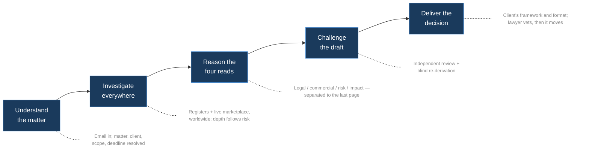

# 01 — Product Overview

> Part of the architecture pack (`docs/architecture/`). The driver's module tree and the headless
> integrator contract are in [`driver/README.md`](../../driver/README.md).

The prelim driver turns a plain-language clearance request into a delivered, lawyer-vetted
preliminary trademark clearance report. One matter in, one decision out — with the investigation,
the reasoning, the challenge, and the paper trail in between run by deterministic code that treats
the model as a reasoning step, never as the orchestrator.

## What it does

A lawyer forwards a clearance request by email. The system resolves the matter (mark, client,
scope, deadline), investigates worldwide — trademark registers and the live marketplace, in the
variations a lawyer would try — reasons the risk in the client's own framework, challenges its own
draft twice, and delivers a client-formatted report with every factual claim traceable to a fetched
source record. A lawyer vets the result, then it moves.

The driver is the machine that runs that whole distance. It is **not an agent**: it is a plain
Node.js process, launched by systemd, that executes a fixed pipeline of stages. Each stage that
requires judgment is one isolated model turn; everything between the turns — sequencing, fan-out,
validation, retries, gates, budgets, publication — is ordinary code. The driver cannot "decide" to
stop early, skip a check, or park a matter: no LLM continuation decision exists anywhere in it.

## What a run produces

Every completed matter is a self-contained run directory plus a published delivery packet:

| Artifact | What it is | Consumer |
|---|---|---|
| **Clearance report** (HTML) | The deliverable: verdict, four reads, rated findings, coverage statement, actions. Client-formatted via the profile layer. | The client, via the vetting lawyer |
| **Audit workbook** (Excel) | Every finding — including deliberately excluded noise — with its written reasoning and source record. Built by pure code from the findings spine. | The vetting lawyer; diligence |
| **Receipts** | Pre-delivery lint, coverage ledger (prose + machine JSON), reasoning-integrity receipt, provider-usage ledger, token rollup. | Operators; auditors |
| **Decision trace** | Append-only event stream of every stage, retry, gate action, escalation, and delivery step (`_driver/run.jsonl`). | Operators; auditors |
| **Fetched records** | The registry records behind every cited registration (`_records/`). A cited record that was never fetched fails the run's closure check. | The audit trail |

The run directory is the product's unit of truth: stages are gated on files existing and validating
(*file truth*), recovery is possible because state is on disk, and the audit trail is not a report
*about* the run — it is the run.

## The run at a glance

The full stage-by-stage mechanics — fan-out, barriers, gates, escalation and repair — are in
[03 — Run lifecycle](03-run-lifecycle.md).

## The four reads

Risk is never one blended number. Every matter carries four separated reads, kept apart from the
first reasoning stage to the final page of the report:

- **Legal read** — would a claim succeed? Client-independent: the same conflict gets the same
  legal read for every client.
- **Commercial read** — would this opponent actually fight, and what kind of fight: a classic
  infringement battle, a negotiation, a paper conflict with a dormant registration, or nuisance?
- **Risk read** — how likely the conflict becomes a real problem, all told.
- **Impact read** — what a fight would mean for *this* client, industry, and launch. The one read
  where the client's world properly enters the analysis.

The separation is engineered, not stylistic: the profile layer can shape emphasis, vocabulary, and
format, but configuration that attempts to move a legal rating is rejected by the system itself
(the anti-threshold guard — see [05 — Customer profiles](05-customer-profiles.md)).

## The disciplines that make it a product

Nine properties distinguish this system from both scoring engines and raw-AI tooling. Each is a
mechanism in the code, not a policy statement — the pointers go to the chapter that documents it.

| Discipline | Mechanism | Documented in |
|---|---|---|
| Judgment encoded, not rules | Doctrine as prose methodology (skills) reasoned by the judgment tier; hard ceilings in a locked rating framework | [08](08-development-guide.md), [05](05-customer-profiles.md) |
| Clients drive the deliverable, never the analysis | Profile layer with closed key enum + anti-threshold guards + stage-level firewall; framework manifests carry vocabulary only, never rules (CI-linted) | [05](05-customer-profiles.md) |
| Four reads, never one number | Findings model carries the reads separately; report templates render them separately | [07](07-quality-and-audit.md) |
| It knows what to leave out | Below-threshold exclusions keep their written reasoning in the audit workbook | [07](07-quality-and-audit.md) |
| Crowding must be earned | A crowded-field mitigation requires the counted, filtered field on the record | [07](07-quality-and-audit.md) |
| Unsearched never means clean | Coverage ledger + coverage clamp; unsearched markets reported as unassessed | [07](07-quality-and-audit.md) |
| No dangling caveats | Closable gaps are closed in-run; time-critical facts promoted to structured actions | [03](03-run-lifecycle.md) |
| A second reader that didn't do the work | Independent refutation stage + blind re-derivation + frame diff | [07](07-quality-and-audit.md) |
| No fact without a record | Record grounding: identifiers copied from fetched records; fidelity auto-correct; citation closure | [07](07-quality-and-audit.md) |

Beneath all nine sit two engineering properties: **judgment on rails** (the deterministic pipeline,
[02](02-architecture.md)) and **a memory that keeps it honest** (the reference library and replay
harness every change to the system's thinking is re-tested against — a discipline someone runs by hand,
not a mechanism: the replay corpus is real client matter on the machine that holds it, invoked from the
command line, the reference library is a paid A/B, and neither is in `npm test` or in CI,
[07 §7](07-quality-and-audit.md#7--the-memory-that-keeps-it-honest)).

## Deployment posture

- The driver runs as systemd `--user` units of one service account (no root units), entirely
  outside any agent sandbox. Where an integrator agent platform is deployed beside it (the
  reference integration), those agents have `exec` denied and can only write queue files.
- Per-customer behaviour is configuration, never a fork: every deployment runs the same engine and
  customers differ only in their profile bundles ([05](05-customer-profiles.md)). Client identities
  are not named here.
- Wall-clock per matter is on the order of several hours — an operational measurement, not a specification:
  deliberate sequencing and provider pacing, with model compute a fraction of it. Stage timeout
  budgets in [04](04-configuration-reference.md) bound the components.
- Concurrency is deliberately conservative and env-tunable. Current defaults and knobs:
  [04 — Configuration reference](04-configuration-reference.md).

## Vocabulary

Terms used throughout this pack and the code. The code's names win over prose descriptions.

| Term | Meaning |
|---|---|
| **Matter** | One clearance request for one mark; the unit of work and of delivery. |
| **Run** | One execution of the pipeline for a matter; lives in one run directory. |
| **Stage** | One pipeline step. Judgment stages are single isolated model turns; code stages are pure Node. |
| **File truth** | A stage counts as done only if its declared output file exists and passes its structural validator. |
| **Gather** | The investigation fan-out: register sweeps and the common-law grid, run concurrently. The blind frame runs beside the whole fan-out as a non-fatal concurrent sibling, never as a member of it. |
| **Fan-in barrier** | The code point where all gather members must have valid outputs before reasoning proceeds. |
| **Skeptic** | The checking stage that re-examines gather output and can trigger code-decided escalation re-runs. |
| **Blind frame** | A threat picture rebuilt from the raw request alone, never seeing the run's own framing. |
| **Frame diff** | The code+model comparison of blind frame vs run frame; can trigger a bounded reopen of investigation. |
| **Verdict gate** | The code gate that parses and validates the verdict; failure triggers corrective re-synthesis. |
| **Coverage clamp** | The code step that forces the report's coverage claims down to what was actually searched. |
| **Coverage honesty** | The doctrine that unsearched is unassessed, never clean; depth follows risk. |
| **Findings spine** | The structured findings model from which the report and audit workbook are built by code. |
| **Park** (`.postponed`) | A rate-limited or deliberately deferred run waiting for a reset window; auto-resumed. |
| **Warm patch** | A bounded repair retry that resumes the model session instead of redoing the stage. |
| **Lane wedge** | A zero-token stalled turn (nothing moved); detected and escalated distinctly from timeouts. |
| **Sentinel** | An on-disk marker file that makes an action idempotent (e.g. `.published`, `.sent`). |
| **Sidecar** | A small metadata file next to a primary artifact (e.g. claimer pid next to a claimed job). |
| **Slug / codename** | Run-directory naming: deterministic slug plus a generated `adjective-noun` codename. |
| **Profile bundle** | A customer's git-owned configuration: structural config, context pack, delivery style, framework. |
| **Context pack** | The client-knowledge layer fed to reasoning as context — sharpens judgment, never overrides it. |
| **Doctrine** | The encoded legal method: the skills prose, rating framework, and worked examples. |
| **Reference library** | Lawyer-blessed verdicts on real matters; every change to the thinking is re-tested against it. |
| **Replay harness** | The $0 pure-file re-run over archived runs; catches structural regressions, not reasoning drift. |
| **Four reads** | Legal / commercial / risk / impact — see above. |
| **Defended draft** | The delivery posture: output a lawyer vets and stands in front of, never an oracle. |
| **Engine** | The pluggable adapter that executes one model turn — `anthropic-agent` or `openai-agent`, selected by `CLEAROTRON_AI` ([02](02-architecture.md)). |
| **Pool** | The shared publish destination for reports and audit artifacts, outside any agent sandbox. |
| **Outbox** | The delivery handoff: published packet + wake mechanics that make sending idempotent. |
