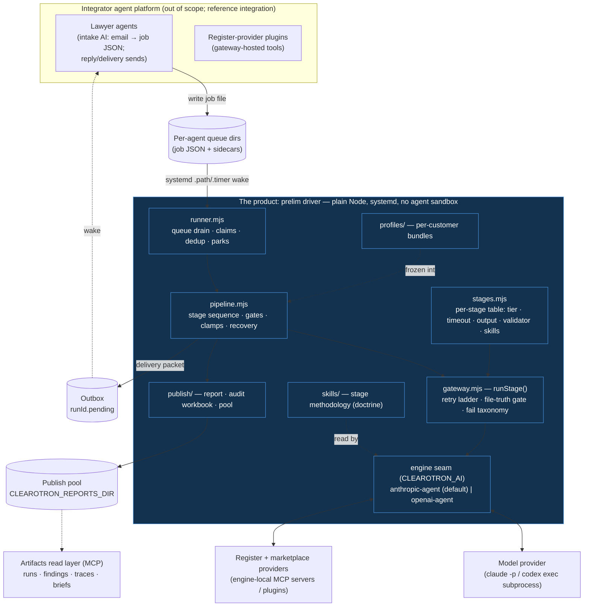
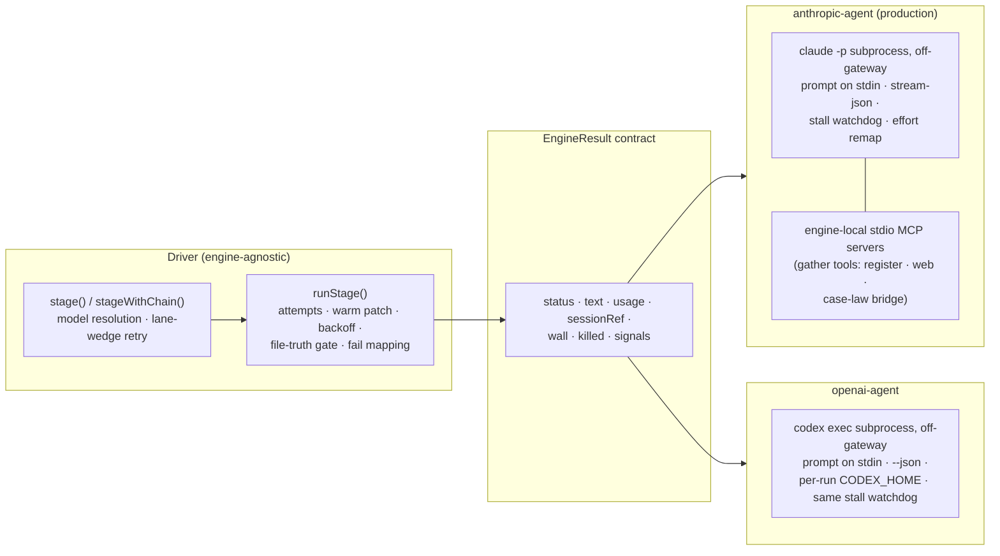

# 02 — Architecture

> Part of the architecture pack (`docs/architecture/`). The driver's module tree and the headless
> integrator contract are in [`driver/README.md`](../../driver/README.md).

## Design principles

Every structural decision in the driver follows from a handful of principles. They are worth
internalizing before reading any code — most "why is it built this way?" questions land on one of
these.

1. **Code orchestrates; models judge.** The pipeline sequence, fan-out, barriers, gates, retries,
   budgets, and delivery are ordinary deterministic Node. A model turn is a leaf: one isolated
   reasoning step with declared inputs and one declared output file. There is no LLM continuation
   decision anywhere — the driver cannot park, wander, or "decide" to skip a check.
2. **File truth.** A stage is done when its output file exists and passes a structural validator —
   nothing else counts. This one rule buys idempotent resume (valid outputs skip), crash safety
   (state is on disk), auditability (the run dir *is* the trail), and honest failure (a missing or
   invalid file is a named failure class, never a shrug).
3. **Payload isolation.** Raw result JSON is never pasted into a model's context. The driver
   dictates specs (grids, plans); register/marketplace tooling writes results to disk; judgment
   stages read code-derived digests and reach the frozen named band **only through a narrow
   read-only grant** (`band_shape`, `band_lookup`, `band_record`, every call appended to the run's
   reading audit) — never the register funnel's search tools. This is the main token-economy lever
   and it is architectural, not a tuning knob.
4. **Fail loud, fail closed, repair first.** Every failure has a class in a closed taxonomy with
   distinct handling; bounded repairs (warm patches, code re-dispatch, quarantines) run before any
   retry burns a fresh session; gates that protect the client (client gate, coverage terminals)
   fail closed; and a run that dies tells the operator on the same guaranteed lane as delivery.
5. **The quality floor never falls back.** Only transient-infrastructure failures may retry or
   fall over; a content or coverage defect never gets handed to a weaker model or waved through.
6. **Configuration is layered and frozen per run.** Environment variables tune mechanics; profile
   bundles carry per-customer knowledge; both are resolved once at run start and frozen into the
   run dir. A run's behaviour is fully explained by its own directory.
7. **Tokens, not dollars.** The driver accounts model usage in tokens only. Cost arithmetic is the
   provider's business; the driver's job is attribution.

## The two substrates

The repository hosts two deliberately separate runtimes. The boundary between them is the product
boundary:

**The driver** is a plain UNIX process under one OS user, triggered by systemd. It is deliberately
*not* an agent: agents on the integrator platform have `exec` denied, run sandboxed to their own
workspaces, and park on model whims — three properties fatal to a clearance pipeline. The driver
needs the opposite: process control, cross-workspace reach (it drains every agent's queue and
publishes to a shared pool), and determinism.

**The integrator agent platform** (reference integration) contributes exactly three things, all
replaceable behind contracts:
1. **Intake** — an agent turns a forwarded email into the validated job file + prose sidecars
   ([03 §1](03-run-lifecycle.md#1--intake-the-queue-file-contract)). The forward itself is the
   human pre-approval.
2. **Delivery's last mile** — sending the composed email/chat message from the delivery packet.
   The driver publishes first, deterministically; only the send rides the integrator.
3. ~~**Comms one-shots**~~ — RETIRED. The intake-reject, duplicate, failure and
   late-bind-ack notices used to make a model a courier for code-composed text; they are outbox
   packets written by code, and no model is asked to send anything.

That describes one integration, not the contract. The contract itself is headless: job-queue intake
([`docs/INTAKE.md`](../INTAKE.md)) and outbox event packets ([`docs/DELIVERY.md`](../DELIVERY.md)).
Any platform that can write a job file and consume packets can integrate.

Everything between intake and send — the entire clearance computation — runs off-gateway on the
engine seam. A buyer replacing the integrator platform rewrites the queue-writer and the
packet-sender; the driver does not change.

## The engine seam

One stage execution = one `runStage()` call = one engine invocation. Everything provider-specific
lives behind the seam (`engine/CONTRACT.md`; selection in `gateway.mjs` `selectEngine()`). Engine
choice is **process-wide**: `CLEAROTRON_AI` is read at every activation and governs every stage of
every job in it. There is no per-stage, per-job or comms-specific override, so comparing the two
engines means flipping the variable and running sequentially, or standing up a second instance.

The contract pins six things (`engine/CONTRACT.md`; note the file is a *spec/review
reference* — the implementation kept a normalized low-level tuple `{code, killed, wall, stdout,
stderr, laneWaitMs, json, usage, reads, readsTruncated, modelWire, sessionRef, signals}` plus a
synthesized gateway-shaped envelope, rather than a literal `EngineResult` object. Thirteen fields,
declared at the head of `engine/anthropic-agent.mjs` and in `CONTRACT.md` §1; `reads` /
`readsTruncated` are the only pair an engine may omit — the openai-agent cannot observe reads and the
gateway journals `null` for it — and every other field, `signals` included, comes off both engines):

- **One normalized return shape** for every engine, mapped by the driver onto the existing
  fail-string taxonomy so the retry/warm/lane-wedge ladder is reused unchanged. The taxonomy is
  load-bearing (warm-eligibility regexes, wedge detection, the run-level recovery classifier) and
  must be preserved verbatim by any new engine.
- **Canonical usage** — `{input, output, cacheRead, cacheWrite, total}`; an all-zero usage defines
  a lane wedge. There is deliberately NO reasoning-token field: `reasoningTokens?` was retired
  2026-07-30 as an unfillable slot — no reasoning count exists anywhere in the `claude -p` payload
  (Anthropic bills thinking inside `output_tokens` and never breaks it out), so it rolled up
  `reasoning: 0` forever, which read as "no thinking" when it only meant "unpopulated".
- **Two gauges, unconditional and three-valued** (`engine/CONTRACT.md` §1–§2 is the contract). What
  IS observable about thinking is whether it *engaged*, per turn: `signals.thought` — `true`/`false`
  from the production engine, judged on thinking-block presence + `signature` and never on the
  block's text (`thinking.display` defaults to `"omitted"`, so an engaged block streams empty), and
  `null` from the openai-agent, meaning "engine does not report". `tokens.mjs` counts `=== true`
  strictly into per-stage `thoughtTurns`, so `null` never inflates it. The AD-4 reads gauge follows
  the same doctrine for what a turn actually opened: `reads` is `[…]` (these files), `[]` (ran and
  read nothing — a recorded fact) or journalled `null` (the adapter cannot observe reads). In both,
  "did not happen" stays distinguishable from "not recorded" — the ambiguity that made
  `reasoningTokens` useless.
- **Tier abstraction** — the contract names three abstract tiers (`judgment` / `sweep` / `cheap`)
  and gives each engine a resolver for them (`engine/CONTRACT.md` §3). The stage table still
  declares concrete model *aliases* and the active engine's model map resolves them. Cross-provider
  substitution is gone: an alias the active engine has no equivalent for **throws** rather than
  quietly running a neighbouring model, because a substitution logs the alias that was asked for and
  bills the one that ran.
- **Session resume** — `sessionRef` threads back for warm patches (`--resume <session_id>` on the
  production engine). Warm resume preserves conversation *context* (the correctness win) but not
  the prompt-cache discount — a known cost frontier, upstream of the driver.
- **Stall watchdog** — both engines stream partial events and kill a turn after a window of zero
  output movement (`CLEAROTRON_STALL_MS`, default 120 s; heavy stages override with a per-stage
  `stallSec`), mapping it to `timeout` so the ordinary ladder handles it. The hard wall is
  `timeoutSec + 60`. `engine/common.mjs` holds the generalized watchdog, the detached
  process-group kill and the buffer-overflow cap, and the openai-agent runs through it; the
  anthropic-agent deliberately imports nothing but node built-ins (only `resolveSpawnCwd`) and
  carries its own byte-equal copies of the stall clock, the kill escalation, the group kill and the
  buffer cap. `test/engine.common.test.mjs` pins the substrate on both liveness policies —
  stderr-as-liveness for `codex`, stdout-only as `claude` parity — and pins the duplicated copies
  against drift, so a change to one cannot silently alter the other.

**The production engine** (`engine/anthropic-agent.mjs`) spawns `claude -p` per stage with the
prompt written to stdin (a large stage message as an argv element would exceed the kernel's
per-arg limit — the E2BIG fix), `--output-format stream-json`, model + effort from the stage table,
and — for every stage whose tool groups resolve non-empty — `--mcp-config` pointing at
**engine-local stdio MCP servers** (`engine/mcp/`), each wrapping a provider core with its own auth
inherited from the engine's env (credentials are never written into the config file). The stages in
`TOOL_FREE_STAGES` (`engine/mcp/gather-config.mjs`) get no MCP config and no tool definitions at
all; `blind-frame` and `skeptic` hold only their own recording server beside the seeded file tools,
so a typed hand-back costs them no retrieval surface; and the band-consuming judgment stages hold a
read-only grant instead — the `band` group, plus `record_coverage` on register-digest and, on
synthesis alone, the web-research tool its mandatory use-check runs through. None of them is handed
the register funnel's search tools (payload isolation). Ambient-context suppression — a neutral
tmpdir cwd (no CLAUDE.md), `--strict-mcp-config`, least-privilege `--add-dir` grants for just the
skills tree and the run dir — keeps the subprocess from inheriting integrator-platform context that would
inflate cost and pollute reasoning; an appended write-discipline system prompt forces actual
Write-tool usage (a `claude -p` turn otherwise tends to compose text and never write the gated
file). Auth is config, not code: subscription OAuth by default (the engine *deletes*
`ANTHROPIC_API_KEY` from the child env so the key can't override the subscription), or API-key
mode via `CLEAROTRON_AI_BILLING=api-key` — the scale setting ([04](04-configuration-reference.md)).

**The second engine** (`engine/openai-agent.mjs`) spawns `codex exec` per stage on the shared
`engine/common.mjs` substrate: prompt on stdin, `--json` event stream, `--skip-git-repo-check` with a neutral non-repo
cwd, `--sandbox workspace-write --add-dir <runDir>`, and a per-run `CODEX_HOME` holding a rendered
`config.toml` (MCP servers + developer instructions) plus, under subscription billing, a seeded
`auth.json`. It is single-provider like the anthropic engine — one run's stages all execute as GPT —
so telemetry's model provenance needs no cross-provider bookkeeping. Its abstract tiers all resolve
to one model id by default; [04](04-configuration-reference.md) records why, and why lowering them
is not a cost saving.

An earlier gateway-hosted engine is **removed**. It was a gateway *runtime* rather
than a provider choice and coupled the driver to one agent platform; an unregistered `CLEAROTRON_AI`
value — that name included — now fails loud rather than running the wrong provider silently. The
cross-provider *failover* chain that was nominally reserved for a multi-provider engine is deleted
: it never ran, and a future multi-provider engine would want a chain designed and tested with
it, not one inherited dormant.

**The register-provider seam** is the second pluggable boundary: `activeProvider()`
(`driver.config.mjs`) selects the register provider from `CLEAROTRON_DATABASE`, which is
**required in every environment and has no default** — unset resolves to `null` and every use of it
throws, so a run refuses at start rather than calling a vendor nobody chose. The clearance pipeline
consumes two provider verbs directly — `recordFetch` (screen-gate, senior-rights, citation-closure
code fetches) and `executePlan` (pure-code re-execution of dictated plan slices during fan-in and
reopen repairs); the knockout lane it dispatches into adds `countHits` and `listRecords`, so four
verbs run with no model in the data path, and every shipped adapter implements all four. On top of
those sit the gather tools the engine exposes to sweep stages. Adapter anatomy and the verification
checklist for a new register estate: [08](08-development-guide.md).

## Data as files

There is no database. Every piece of state is a file with a defined owner, and every coordination
primitive is a filesystem primitive chosen for its atomicity:

| Primitive | Used for | Why it works |
|---|---|---|
| `rename(2)` | queue claims, takeover locks, park/unpark, publish/archive moves | atomic on one filesystem; exactly one winner |
| `open(O_CREAT\|O_EXCL)` (wx-create) | slot locks, reclaim mutexes | atomic existence test + create |
| tmp-write + `rename` | every frozen sidecar, meta, receipt | readers never see a torn file |
| append-only JSONL | decision trace, telemetry, ledgers | crash-tolerant; torn tails skipped by readers |
| sentinel files | `.published`, `.sent`, `.delivered`, `.postponed`, `.failed` | idempotency = "does the file exist" |
| pid+starttime sidecars | claim liveness, slot ownership | survives pid reuse; positive-evidence death only |

The run directory ([03 §7](03-run-lifecycle.md#7--run-directory-anatomy)) is the unit of truth;
the queue dirs, the known-conflicts store, the outbox, and the publish pool are the only shared
locations, and each has a single writer role. This is why horizontal
scaling is credible: a second driver on a second host needs sharded queues and a shared pool,
nothing else.

## Module map

All paths relative to [`driver/`](../../driver/). The load-bearing seven are marked ●.

| Module | Role |
|---|---|
| ● `runner.mjs` | Queue drain: claims, dedup, parks, orphan reclaim, admission budget, graceful stop. |
| ● `pipeline.mjs` | The run: stage sequence, fan-in gates, clamps, delivery, recovery. The largest module in the tree; [03](03-run-lifecycle.md) is its map. |
| ● `stages.mjs` | The clearance lane's per-stage declaration table (tier/model, thinking, timeout + stall, skill reads, output, validator) + stage messages. Not the only one: the knockout lane keeps `KO_STAGES` in its own table. |
| ● `gateway.mjs` | `runStage()`: attempt ladder, warm patch, file-truth gating, fail taxonomy, engine selection, turn/ping lanes. |
| ● `engine/` | The engine seam: `CONTRACT.md`, `anthropic-agent.mjs`, `openai-agent.mjs`, `common.mjs` (shared spawn/watchdog substrate), `mcp/` (engine-local gather servers). |
| ● `verify.mjs` | Structural validators for every stage output + `parseVerdict` (the verdict gate's parser). |
| ● `driver.config.mjs` | Env → config resolution: paths, caps, engine + register-provider selection, credential preflight. |
| `pipeline-knockout.mjs` · `stages-knockout.mjs` · `verify-knockout.mjs` | The knockout (triage) lane: its own run body, its own stage table (`KO_STAGES`) and its own validators. `pipeline()` dispatches into it on a knockout policy, so its stages can never leak into the clearance `STAGE_ORDER`. |
| `phase0.mjs` | Pure run identity: slug, codename, dates, run/archive dirs. |
| `enqueue-schema.mjs` | Job-file shape, `validateJob` classification (reject/clarify/run). |
| `slot-lock.mjs` | Cross-process counting locks (run slots, turn/ping lanes). |
| `profiles.mjs` · `profiles/` · `framework.mjs` | Per-customer layer: bundle resolution, freeze, rating framework. [05](05-customer-profiles.md). |
| `coverage-ledger.mjs` | Coverage-ledger contract: strict JSON mirror, prose parser, axes decisions. |
| `findings-model.mjs` | The findings spine: structure, validation, consolidation. |
| `registry-fidelity.mjs` | Record grounding: citation closure, identifier auto-correction from records. |
| `named-band.mjs` · `register-taint.mjs` · `register-plan.mjs` | Band merge/gates, timeout-taint machinery, plan compilation. |
| `form-neighbourhood.mjs` · `phonetic-key.mjs` · `connotation-search.mjs` | Mechanical variant floor, phonetic keys, meaning-query dictation. |
| `blind-frame-model.mjs` · `frame-diff-model.mjs` | Blind re-derivation + diff models. |
| `rule-shape.mjs` · `reasoning-tripwires.mjs` · `gate-metrics.mjs` | Anti-threshold guard, integrity tripwires (observe-only), gate telemetry. |
| `predelivery-lint.mjs` · `close-verify.mjs` · `screen-gate.mjs` | Pre-delivery checks, envelope close verification, screen-gate detection. |
| `common-law-receipts.mjs` · `engagement-receipt.mjs` · `scope-ledger.mjs` | Receipt models for the marketplace grid, engagement, scope. |
| `senior-rights.mjs` · `own-rights.mjs` · `use-check.mjs` · `known-conflicts.mjs` | Rights closure, self-exclusion, use analysis, recall store. |
| `publish/` | Deterministic publication: HTML render, Excel audit workbook, pool admin, regions. |
| `repairs.mjs` · `repair-digest.mjs` | Recovery decisions, repair budgets, repair digests. |
| `tokens.mjs` · `provider-usage.mjs` · `progress.mjs` · `status-snapshot.mjs` · `run-activity.mjs` | Token rollup (successor to the deleted `cost.mjs`), billing-grade provider ledger, status surfaces. |
| `replay-archive.mjs` · `compare.mjs` | The $0 replay harness over archived runs; run comparison. |
| `skills/` | Stage methodology (doctrine) read by the engine per stage. [08](08-development-guide.md#how-to-edit-doctrine-skills). |
| `systemd/` | Unit files: driver path/service/timer, outbox path/service/timer, profile service. [06](06-operations-runbook.md). |
| `test/` | the `*.test.mjs` suite (+ mock binaries/fixtures), run through the workspace test script. [08](08-development-guide.md#testing-reference). |

## Boundary inventory — where the product ends

For a buyer: these are the exact surfaces to re-point, and nothing else.

| Direction | Contract | Documented in |
|---|---|---|
| **In** | Job file + prose sidecars in a watched queue dir (schema: `enqueue-schema.mjs`, `EXAMPLE_JOB`) | [03 §1](03-run-lifecycle.md) |
| **In** (ops) | CLI: `pipeline.mjs --job/--resume/--from/--experiment`; `runner.mjs` | [03 §6](03-run-lifecycle.md), [06](06-operations-runbook.md) |
| **Out** | Published report (templated HTML) + Excel audit workbook + receipts in the pool | [07](07-quality-and-audit.md) |
| **Out** | Delivery packet (`_driver/delivery.json`: composed email HTML, chat text, URL, verdict) + outbox wake marker | [03 §4](03-run-lifecycle.md) |
| **Out** | Failure packet on the same lane (`_driver/failure.json`) | [03 §5](03-run-lifecycle.md) |
| **Sideways** | Artifacts MCP read layer (runs, findings, traces, briefs; scoped client tokens) — effectively the product API | [07](07-quality-and-audit.md), [09](09-security-and-data.md) |
| **Providers** | Model engine seam (`engine/CONTRACT.md`) · register-provider seam (`activeProvider()`) | above; [08](08-development-guide.md) |
