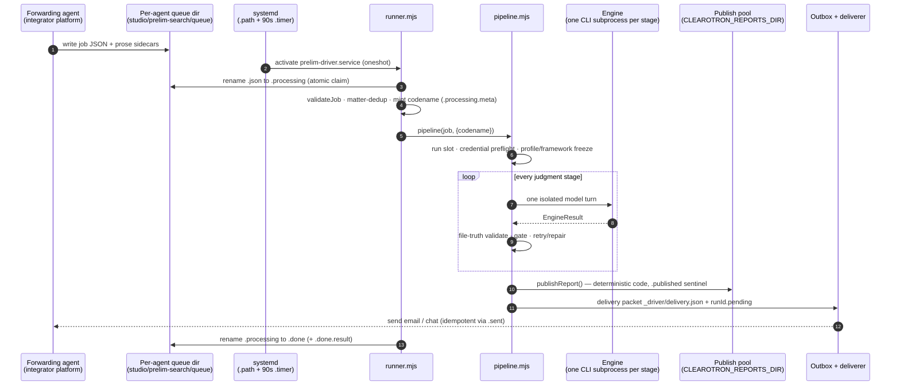
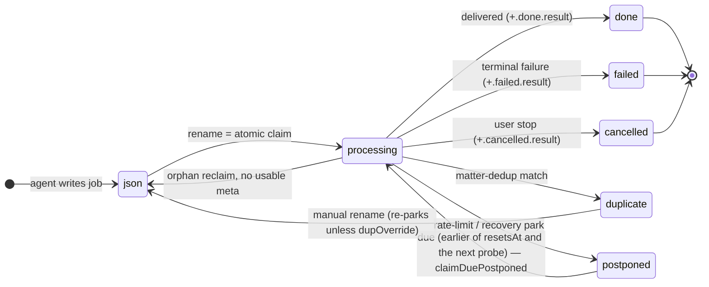
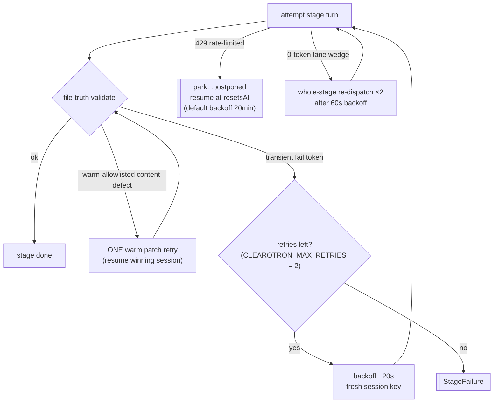
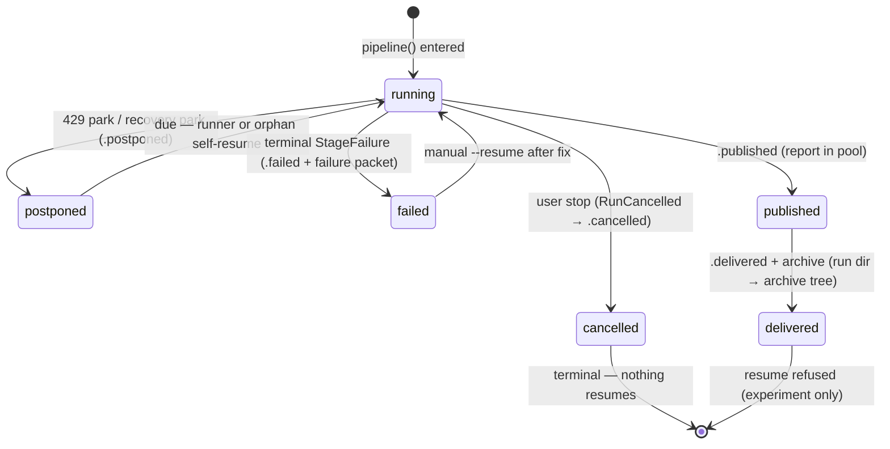

# 03 — Run Lifecycle

> Part of the architecture pack (`docs/architecture/`). The driver's module tree and the headless
> integrator contract are in [`driver/README.md`](../../driver/README.md).

This chapter follows one matter from the queue file that starts it to the delivered report — every
claim, stage, gate, retry, park, and sentinel on the way. It is the chapter an operator reads to
understand *what the system is doing right now*, and the chapter a maintainer reads before touching
`runner.mjs` or `pipeline.mjs`.

Two doctrines govern everything below:

- **No judgment-driven halt.** A run only stops without delivering on a *technical* failure
  (`StageFailure` → `.failed`), on a user's stop (`RunCancelled` → `.cancelled`, terminal — nothing
  was delivered and nothing resumes) or on a runner grace-exit (`.parked` + status
  `parked-for-human`, resumed on the next activation); it pauses on a rate limit (`.postponed`,
  auto-resumed). None of the four is a judgment call about the evidence: if the evidence is thin the
  run ships a CONDITIONAL report that says so — insufficiency is a verdict, never a halt
  (`pipeline.mjs`).
- **File truth.** A stage counts as done only when its declared output file exists and passes its
  structural validator. Every recovery path — resume, retry, repair — is built on re-checking files,
  not on remembered state.

## The lifecycle at a glance



The forwarding agent's only role is writing the queue file — agents have `exec` denied by gateway
policy on the integrator platform (reference integration), so the driver is a plain OS process,
never an agent ([02 — Architecture](02-architecture.md)).

## 1 — Intake: the queue file contract

A job arrives as `<id>.json` in the forwarding agent's own queue directory, where `<id>` is the
sanitized email message-id — a re-delivered webhook **overwrites the same file** while the job is
still queued (`enqueue-schema.mjs`); once claimed, the enqueue-side idempotency check and the
matter-dedup gate below carry that window. The enqueue-side contract (the intake skill that writes
these files) is seeded into each forwarding agent's workspace — the copies must stay byte-identical
or the contract forks; treat them as one file.

**Manifest + prose sidecars.** The manifest carries only scalars. Free-prose fields ride as raw
sidecar files next to it (`<id>.brief.md`, `.rawRequest.txt`, `.markName.md`, `.goods.txt`,
`.upfrontInstructions.txt`, `.deliverableSpec.txt`, `.commercialFlexibility.txt`, `.priorUse.txt`,
`.campaignShape.txt` — the vocabulary is `PROSE_PARTS` in `queue-markers.mjs`, which `runner.mjs`
imports rather than restates, because two hand-kept copies of this list have already disagreed). The
reason is hard-won: the enqueuing agent can only *write files*, not run a serializer, and a single
unescaped quote in a brief once produced an unparseable job file. Prose is read raw, never
JSON-parsed; a non-empty sidecar wins over the manifest value. Sidecars are never
renamed on claim — they must survive a crash-reclaim — and are removed only at terminal state.

**Validation** (`validateJob`, `enqueue-schema.mjs`) is the mechanical backstop behind the
intake AI, and classifies rather than just rejecting:

| Class | Meaning | Examples |
|---|---|---|
| `reject` | Can't run and can't even reply | not an object; no `id`; no reply path at all (`msgId` + `forwarderEmail` + `forwarder` all missing); no `forwarder` |
| `clarify` | Identity fine, search subject unresolvable | no mark name anywhere; neither classes nor goods; unknown `profileKey` or `projectKey` |
| `run` | Good to go | warnings may note proceed-with-default choices |

Warnings never block: a missing TMP reference produces a `noref` slug instead of a silent reject;
an unknown customer proceeds on the generic profile with a late-bind watch (§4).

**Matter-level dedup** (`runner.mjs`). Queue-file dedup is per *message*; a "please
proceed" reply in an already-handled thread arrives under a new message-id. The driver therefore
keeps a matter ledger (`studio/prelim-search/.matter-ledger.jsonl`) and parks as `.duplicate` any
job within the window (a fixed 24 hours) that matches a prior entry by
exact signature (`forwarder|mark|classes|customer|ref`, plus a `|level:<product>` dimension on any
non-baseline product) or by same conversation-thread with agreeing mark *and* agreeing product. The
product dimension is why a knockout→clearance escalation of one matter — same forwarder, mark,
classes, customer and ref — is never parked as a duplicate; that escalation is the offering's
headline flow. Three distinct marks forwarded in one thread all run; a forced re-run is
`dupOverride: true` in the job. Failed runs drop their ledger entry so a genuine re-send is never
blocked.

## 2 — Claim, identity, and crash-safety

**The claim is a rename.** `renameSync(<id>.json → <id>.processing)` — rename(2) is atomic, single
winner (`runner.mjs`). A `.pid` sidecar records `<pid>:<starttime>` (starttime taken from
`/proc/<pid>/stat` field 22) so a recycled PID can never impersonate a dead claimer.

**Run identity is minted before any spend.** The codename (`adjective-noun`) is minted at dispatch
and written atomically to `<id>.processing.meta` *before* the pipeline starts (`runner.mjs`).
A crash anywhere after that resumes the *same* run directory instead of re-spending a fresh run.
Run dirs are `<workspace>/studio/prelim-search/<slug>/<date>-<codename>`, slug =
`tmp<n>-<kebab-mark>` (or `noref<6-hex>-<mark>` when no reference was given; `phase0.mjs`).

**Orphan reclaim** (`runner.mjs`) runs once per drain. A `.processing` whose claimer is
provably dead (positive evidence only — pid gone, or starttime mismatch; EPERM counts as alive) is
taken over via an atomic rename-lock (`.processing.claimed-<token>`), with the claimer re-verified
under the lock. Routing then follows the `.meta` codename: a run dir that is already delivered is
consumed as `.done` (never re-run — a crash in the post-delivery window once double-delivered a
report; "delivered" means *any* of the `.delivered` sentinel, a
`_driver/delivery.json` packet, or `status.json` state `delivered`, which closes the sub-second crash
window between packet and sentinel); a live undelivered run dir resumes under its original
codename; no usable meta means a legacy fresh re-claim. Claims older than `CLEAROTRON_MAX_CLAIM_AGE_MS` (default 48h, measured from the
`.pid` sidecar's mtime — the `.processing` mtime is enqueue time and lies) are re-claimed
regardless of liveness.

**Queue marker states:**



**Runner shape.** The runner is a systemd `Type=oneshot` drain, not a daemon: the `.path` unit
fires it the instant a queue file lands, the 90s `.timer` is the backstop, and systemd's oneshot
semantics guarantee two triggers can't produce two concurrent drains. Queues drain concurrently
across agents (`Promise.allSettled` — one queue's fs error must not kill sibling runs), claims are
serial within a queue (dedup stays race-free), and prepared runs execute concurrently under the
run-slot cap. An idle tick with no work exits before the gateway preflight, so the 90s cadence
costs nothing. Fresh work is re-scanned every `CLEAROTRON_QUEUE_SCAN_MS` (10s) mid-drain. After
`CLEAROTRON_ADMISSION_BUDGET_MS` (2h) the drain stops claiming and exits; leftover work re-triggers a
fresh activation with a fresh clock — the 6h `TimeoutStartSec` in `systemd/prelim-driver.service`
only ever fires on a wedged runner. First SIGTERM closes admission gracefully and arms a bounded
grace window (`CLEAROTRON_STOP_GRACE_MS`, default 60 s) for in-flight work to finish or reach its
postpone checkpoint. With stage walls running to tens of minutes a run mid-stage usually reaches
neither, so whatever the exit cuts gets a `.parked` sentinel plus status `parked-for-human` and
resumes from its identity meta on the next activation. A second signal exits at once, parking the
same way.

**Concurrency caps** (details in [04](04-configuration-reference.md)): the run-slot lock caps whole
concurrent runs (`CLEAROTRON_MAX_CONCURRENT_RUNS`, default **2**; acquired by *every* `pipeline()`
entry, including manual CLI runs). That is the only cap. A second one — `CLEAROTRON_TURN_CAP` — fenced the
command lanes of an agent gateway, and it went with that gateway: compute engines run
off-gateway and never took a lane, so by the end it governed an empty set. Compute parallelism is
`CLEAROTRON_GATHER_CONCURRENCY × CLEAROTRON_MAX_CONCURRENT_RUNS`.

## 3 — The stage sequence

Everything below happens inside one `pipelineInner()` call (`pipeline.mjs`), inside one big
try/catch whose catch is the recovery machinery (§5). Before any model spend: run slot, register
credential preflight (fail-fast — a resume without the provider credential must not burn stages),
profile freeze to `_driver/profile.json`, framework freeze, instructed-scope record, and status
seeding. Frozen sidecars are never silently re-derived; a corrupt one crashes loudly by design.

```mermaid
flowchart TD
    subgraph HEAD["Phase 1-2 head (fatal)"]
        MF[matter-frame] --> PV[prelim-variants]
        PV --> DER["code derivations:<br/>scope ledger · form neighbourhood ·<br/>register plan freeze · recall probes"]
    end
    DER --> GRID["grid spec dictated by code<br/>(terms × platforms × connotation; A1 split)"]
    subgraph GATHER["Gather fan-out (concurrency = CLEAROTRON_GATHER_CONCURRENCY)"]
        CL["common-law-half:a/b/m<br/>(two grid halves + the meaning seat)"]
        RU["register-unit:&lt;axis&gt;<br/>(per register axis)"]
        BF["blind-frame<br/>(non-fatal sibling)"]
    end
    GRID --> GATHER
    GATHER --> FANIN{{"fan-in barrier (code):<br/>quarantines · must() · half-merge ·<br/>named-band gate · taint chain ·<br/>plan⇄band identity join · grid-ledger gate"}}
    FANIN --> CLOSURE["coverage closure pass<br/>(one supplementary sweep, non-fatal)"]
    CLOSURE --> PI[placement-inquiry] --> RD[register-digest]
    RD --> SK["skeptic (non-fatal)"]
    SK --> ESC{"ESCALATE: axis tokens?"}
    ESC -- yes --> RERUN["re-run flagged axes warm ·<br/>byte-diff · one re-digest"] --> ENV
    ESC -- no --> ENV["deadline envelope:<br/>close deferred floors if time allows"]
    ENV --> SG{{"screen-gate: dropped LIVE mark<br/>without fetched record?<br/>fetch → re-digest → else FATAL"}}
    SG --> FD["frame-diff vs blind frame<br/>+ bounded reopen (non-fatal block)"]
    FD --> SYN[synthesis]
    SYN --> PAR["case-law ∥ narrative-refutation<br/>(case-law non-fatal)"]
    PAR --> VG{"verdict gate:<br/>parseVerdict(review)"}
    VG -- "CONDITIONAL / BLOCKING" --> CORR["corrective re-synthesis (fatal) ·<br/>corrections freshness gate ·<br/>verdict re-check (warm)"] --> VG2{"still BLOCKING?"}
    VG2 -- yes --> FAIL[["FATAL StageFailure('verdict')"]]
    VG2 -- no --> CLAMP
    VG -- CLEAR --> CLAMP["code clamps (raise-only):<br/>legal actions · coverage · frame residual ·<br/>screen gate · register gap · deadline gap"]
    CLAMP --> VS["verdict sidecar _driver/verdict.json<br/>(single label authority; write failure = fatal)"]
    VS --> REP["report-overview (fatal) ·<br/>report-card fan-out (per-card non-fatal)"]
    REP --> AUD["audit build from findings spine<br/>(code, count-guarded, non-fatal)"]
    AUD --> LINT["pre-delivery lint + repairs:<br/>record closure · registry auto-correct ·<br/>warm redos ·<br/>reasoning-integrity receipt (observe-only)"]
    LINT --> CG{{"client-gate preflight (fail-closed)"}}
    CG --> PUB["publish (deterministic code,<br/>.published sentinel, pool)"]
    PUB --> HANDOFF["delivery packet _driver/delivery.json ·<br/>outbox <runId>.pending · .delivered · archive"]

    classDef fatal stroke:#c0392b,stroke-width:2px
    class MF,PV,PI,RD,SYN,FAIL,VS,CG fatal
```



Reading order for the phases, with what code decides at each:

1. **Head stages** — `matter-frame` then `prelim-variants`, both fatal. Code then derives the
   scope ledger, the *form neighbourhood* (the model picks the distinctive token; the machine
   generates the complete mechanical variant floor), freezes the register plan
   (`_driver/register-plan.json`, frozen for the life of *this run* — a resume never re-plans, and a
   fresh run always mints; reproducibility comes from the compiler being pure, not from a store of
   prior plans), and folds in **recall probes** — prior confirmed conflicts for this mark from the
   workspace store become deterministic plan entries (cap 10).
2. **Grid dictation** — code writes `_driver/grid-spec.json`: exact terms × platforms, connotation
   queries, batch size, `ledger_required: true`. With ≥2 terms the grid is split across three
   seats — unconditionally since  item 8 deleted the rollback switch: halves`a` and `b` take
   the dictated terms by
   deterministic parity, and the **meaning seat** `m` takes every dictated connotation query and no
   terms at all — a recurrence floor is a property of the whole sweep, so a term-partitioned seat
   could owe an obligation at the merge that neither half could see.
3. **Gather fan-out** — register units (one per axis, axes decided by code from the variant
   manifest + plan), the three common-law seats, and `blind-frame` as a non-fatal concurrent sibling
   that reads *only* the raw instruction.
4. **Fan-in barrier** — pure code, and the densest gate cluster in the system
   (`pipeline.mjs`): band-vocabulary quarantine, single-half transient quarantine,
   `must()` on every member, half-merge + canonical re-validation, connotation identity join (a
   dropped dictated meaning-query is fatal — count-based gates can't see it), plan⇄band identity
   join with a code-dispatch repair ladder, the **named-band hard gate** ("a clean can never ship
   over an unsearched band"), the timeout-taint chain (quarantine → code re-dispatch → one fresh
   re-run → park or disclose), and the grid-ledger contract gate. Repairs are budgeted by a
   persistent repair ledger (`_driver/repairs.json`) so no ladder is ever bought twice.
5. **Coverage closure** — one supplementary sweep for closable coverage-limited cells, idempotent
   by receipt; survivors become a front-matter coverage note, not a halt.
6. **Placement → register-digest** — both fatal. Every digest pass (fresh, escalation, envelope,
   late-bind, stale-repair) goes through the single `runDigest` chokepoint, which drops stale ledgers,
   renders the coverage ledger from the driver-written coverage form the seat submits through
   `record_coverage` — the prose `## Coverage ledger` table and the machine-readable JSON are both
   renders of that one form, so neither can be the thing that drifts (prose parsing survives only as
   the fallback when the derivation throws) — and quarantines rather than ships a ledger that fails
   its validator.
7. **Skeptic + escalation** — the skeptic is deliberately non-fatal (a checker outage must not bin
   a completed gather). Escalation is triggered only by structured `ESCALATE: <axis>` tokens; an
   axis whose every owned ledger row is `coverage-limited` is skipped (documented accepted limit);
   flagged axes re-run warm on their winning session keys, byte-diff guards skip unchanged units,
   then exactly one re-digest. A digest lock forbids escalation after synthesis exists on a resume.
8. **Deadline envelope** — pure arithmetic: if the deadline leaves room after an estimated close
   cost plus a one-hour delivery reserve, deferred floors get one warm close attempt, verified by
   re-running the detectors; unverifiable closes are disclosed, never claimed.
9. **Screen-gate** — an in-scope *live* mark dropped on goods/field grounds without a fetched
   record is repaired (code fetches the record, one warm re-digest) or the run dies: an
   unexaminable drop is not shippable.
10. **Frame-diff + bounded reopen** — the blind frame is diffed against the run's own framing;
    directives (including deterministic mechanical form-gap directives) can reopen register and
    source arms once, under a fetch ceiling (`CLEAROTRON_REOPEN_MAX_FETCH`, default 150), with
    per-directive closure verification. The whole block is non-fatal; unclosed directives demote to
    disclosed deferrals that later clamp the verdict.
11. **Synthesis** — fatal. Malformed findings get one warm re-emit naming exactly the defective
    objects; still-malformed findings after the ladder are terminal (the old quarantine-and-continue
    is retired). Schema and actions[] upgrades are demanded warm on runs where synthesis actually ran.
12. **Case-law ∥ narrative-refutation** — concurrent; case-law non-fatal. The reviewer receives
    code-computed registry-fidelity probes and an unconditional plan-execution check demand. Its
    verdict is parsed by code; a parse failure is **BLOCKING** (fail-safe). CONDITIONAL/BLOCKING
    triggers corrective re-synthesis (fatal if it fails), a freshness gate proving the named
    corrections reached `findings.json`, and a warm verdict re-check. A still-BLOCKING verdict
    after the degenerate-artifact repair is a fatal run failure — "delivered with open questions"
    is retired.
13. **Code clamps** — the coverage floor (`applyCoverageFloor`) only ever *raises* CLEAR to
    CONDITIONAL: typed condition actions, the lawyer's explicit `coverage_judgment.sufficient ===
    false`, frame residuals, screen-gate gaps, register gaps (from the taint-relabelled ledger),
    deadline-carry gaps. Execution facts clamp in code regardless of the model's self-report. The
    **verdict sidecar** (`_driver/verdict.json`) then becomes the single verdict authority for
    everything downstream; failing to write it is fatal.
14. **Delivery phase** — report overview (fatal), per-finding report cards (fan-out, individually
    non-fatal, assembled by code with a code-built "Only you can close these" section), client
    audit workbook from the findings spine (code, count-guarded, non-fatal), then the pre-delivery
    lint block: registry-record closure (every cited register URI owes a fetched record — absentees
    are code-fetched), lint checks, registry identifier auto-correction *from the record*, one warm
    redo ladder for repairable lint failures, the always-written lint receipt, and the
    reasoning-integrity receipt (observability only, never a gate — an explicit Goodhart guard).
15. **Client-gate + publish + handoff** — the client gate is evaluated fail-closed *before*
    anything touches the pool. Publish is deterministic code, idempotent via `.published`. Then the
    delivery handoff (§4), known-conflicts store upsert, `status.json` flip to `delivered`,
    archive (the run dir is renamed into the archive tree), and the `.delivered` sentinel.

**Fatal vs note-and-continue.** The full lists live in `pipeline.mjs` (the outer catch), but the shape is:
*fatal* = the head stages, gather members after quarantine, the fan-in gates, digest passes,
synthesis, refutation, the verdict terminal, the verdict sidecar, report-overview, the zero-rows
coverage terminal, the core-artifact gate, and the client gate. *Note-and-continue* = every checker
and enrichment (blind-frame, frame-diff/reopen, skeptic, case-law, per-card renders, audit build,
closure passes, receipts, rollups, notify). An outage in a checker never destroys completed gather work.

**One report, no client fork.** There is no separate client-facing summary artifact and no stage
that writes one: a live run produces one report, and what a non-staff reader receives is prepared at
serve time from it. The lint checks and validators that used to cover a second surface are kept so
archived runs still replay unchanged, but a live run passes them nothing. The report a client reads
is guarded by the code-built verdict-bound row, the pre-delivery lint, and the client gate.

## 4 — Delivery handoff

Publication and notification are decoupled on purpose: the report is published by code *before*
any notify, and both halves are idempotent.

- **Delivery is one behaviour, not a mode.** Since there is no setting to resolve and no
  second lane: the engine in use does not enter into it and neither does the environment. The
  pipeline writes a self-contained
  packet `_driver/delivery.json` (email HTML composed by code, chat text, URL, verdict), resets
  per-send state (`.sent`, `_driver/send-receipts.json`), and drops `<runId>.pending` into the
  outbox dir. The outbox `.path` unit wakes the deliverer instantly; the outbox `.timer`'s
  50-minute rescan is the backstop. A lost wake can delay a send; it can never lose or double-send
  one — the deliverer re-derives everything from the packet and the sentinels.

**Late-bind** deserves a note: a job forwarded for an unknown customer runs on the generic profile
with four code checkpoints (`pre-matter-frame`, `pre-digest`, `pre-synthesis`, `pre-delivery`)
polling for a `customer-bind.json` dropped by the operator; each checkpoint applies the strongest
still-safe action its phase allows (`lateBindAction`: fold the job, ride the digest message,
re-digest warm, or a front-matter note) and acknowledges as a `late-bind-ack` outbox packet
(`<runId>.bindack`). There is one lane: since the packet IS the acknowledgement.

## 5 — Failure handling

The failure taxonomy is closed, and every class has distinct handling
(`engine/CONTRACT.md`, `gateway.mjs`):

`timeout | lane_wedge | embedded_fallback | nonzero_exit_<code> | unparseable_json | status_<s> |
status_overloaded | rate_limited | max_tokens_no_output[:<fail>] | model_mismatch:<asked>-><served> |
missing_file:<f> | invalid_file:<f>:<reason>`

Four of those carry a policy of their own rather than climbing the ladder. `status_overloaded` and
`model_mismatch` break the same-model ladder on sight — re-attempting an API that just said it is
saturated, or re-sending the same argv to the provider that just substituted a model, buys only the
same answer, and every number a mismatched turn produced would be attributed to the wrong model.
`rate_limited` returns immediately so the run parks (below). `max_tokens_no_output` names the
output-budget ceiling as a *detected fault*, so the correction tells the stage to shrink its output
and a second byte-identical hit breaks the ladder instead of re-buying the same wall.

**The per-stage ladder** (owned by `runStage`, [02](02-architecture.md)):



Two rules bound the ladder: a **timeout** gets exactly one 1.5×-extended shot, and the **quality
floor** — only transient-infrastructure failures earn a repeat (`isFallbackEligible`); a content or
coverage failure never does, because a repeat there would trade a loud failure for a quiet quality
drop. **This ladder is the whole failure story.** Below it a stage fails, and the run parks or reports.

There is no model failover beneath it. A chain (same-family fallback, then a cross-provider tail) was
declared in the code until 2026-08-03 and **never ran on any shipped build** — no stage declared a
fallback, and the tail's engine gate was never true. It was deleted, not armed: arming it means
untested code firing for the first time mid-failure, and a silent mid-run model swap changes which
model makes judgment calls inside one matter. What carries recovery, and always did, is the same-model
ladder, the lane-wedge re-dispatch, and the rate-limit park.

**Rate limits are parks, not failures.** A 429 at any stage throws a rate-limited `StageFailure`
that the outer catch converts to a `.postponed` sentinel with a self-contained resume payload
(job, agent, codename, fromStage, resetsAt). The runner resumes it when due, and a provider-supplied
`resetsAt` is an **upper bound rather than the authority**: the run wakes at the earlier of that
reset and its own next probe (`CLEAROTRON_RATE_LIMIT_PROBE_MS`, 10 min, doubling per refused probe to a
40-minute ceiling), because a cap lifted ahead of its stated reset once left a run asleep until a
human nulled the timestamp by hand. With no usable reset the wait is `postponedAt +
CLEAROTRON_RATE_LIMIT_DEFAULT_BACKOFF_MS` (20 min; immediate resume would hot-loop a failing stage every
90s tick, which is precisely the incident that set this default). A *recovery* park keeps its exact
clock — `recoveryResumesAt` is the driver's own backoff, so there is nothing external to contradict it.

**Auto-recovery.** Any other failure is classified (throw-site `failClass` wins over text
heuristics) and fed to `decideRecovery` with the run's append-only recovery history: transient
classes get the full park ladder (backoffs 2/15/60 min, `CLEAROTRON_RECOVERY_MAX` = 3), unknown gets
one park, deterministic/factual and the non-recoverable denylist (credentials, config, job shape)
get none. A repeat failure-signature is never bought twice **in the defect lane** — the run's own
output failing identically has disproved itself. The other lane is weather (`recoveryLaneOf`: a
transient whose reason is outage-shaped — 5xx/429/overloaded/ECONNRESET), where waiting *is* the
remedy, so a signature may repeat and that is exactly how the 2/15/60 rungs escalate; the weather
lane is bounded separately at two full ladders and ends on its own terminal kind. Parks of either
kind resume plain and idempotent — completed stages skip on file truth.

**Terminal failure is loud by design.** The run dir gets `.failed` (stage, reason, signature,
class, terminalKind), status flips to `failed`, and the operator notice rides the *same guaranteed
lane as delivery*: a code-authored failure packet (`_driver/failure.json`) plus an outbox marker —
so a run can fail, but it cannot fail silently, even with the integrator platform down. A manually
resumed orphan that keeps re-parking hits `REPARK_MAX = 3` and goes terminal through the same
circuit breaker.

**One terminal kind is not a failure.** `terminalKind: "designed-refusal"` means the product declined
the order it was given — a preflight found that this deployment cannot serve the search that was asked
for, and said so before any spend. The knockout lane's register preflight is the one that raises it
today. `state` is still `failed` (nothing was delivered, and every status surface switches on that
closed vocabulary), but the kind travels with the run into every record that carries it: `status.json`,
the `.failed` sentinel, `run.jsonl`, `_driver/failure.json`, and the terminal result the runner writes
beside the queue marker. Read it before reading a failure count: the ops recurrence digest excludes
these from its defect groups and reports them as their own line, and the failure notice says REFUSED
rather than FAILED. Nothing about a refusal is retried, parked or recovered — the remedy is always the
order or the deployment, never a re-run.

**Run states on disk:**



## 6 — Resume, experiment

All resume machinery keys off the run directory, never off memory:

```
node pipeline.mjs --job <file.json> [--agent <id>]        # cold run (still takes the run slot)
node pipeline.mjs --resume <codename>                     # idempotent resume: valid outputs skip
node pipeline.mjs --resume <codename> --from <stage>      # force re-run from a stage ordinal
node pipeline.mjs --resume <codename> --experiment <stage> [--label <t>]                  # shadow dir
```

- **Resume** refuses a delivered run (any of the three delivered markers above — re-handing off a
  delivered run would reset `.sent` and re-send); clears stale `.failed`/`.postponed`; reads the
  run date off disk. Frozen profile/framework/plan sidecars win over re-derivation.
- **`--from`** forces stages at or after the named ordinal even if their outputs validate; earlier
  stages still skip. A `--from synthesis` fork deliberately does *not* lock the digest.
- **`--experiment`** runs one stage in a shadow dir (`_experiments/<ts>-<tag>/`) on copies of its
  inputs, under a `prelim-exp-…` session key that is excluded from the run's provider-usage
  attribution. The canonical run is untouched.
- **Orphan self-resume**: a manually resumed run that parks has no queue sidecars; the runner scans
  run dirs for due, payload-complete `.postponed` sentinels not owned by any queue and resumes them
  (claim = atomic rename to `.resuming`).

## 7 — Run directory anatomy

The run directory is the complete state of a matter. Everything an auditor, a resume, or a repair
needs is in it:

```
<slug>/<date>-<codename>/
├── .postponed | .parked | .failed | .cancelled                # park/terminal sentinels (lifecycle above)
├── .published | .delivered | .sent                            # delivery sentinels (idempotency)
├── status.json · run.jsonl                                    # state + append-only decision trace
├── _driver/
│   ├── profile.json · framework.json · register-plan.json     # frozen per-run config (never re-derived)
│   ├── grid-spec.json (+ .half-a/b, .supp-*)                  # code-dictated search specs
│   ├── coverage-enum.json · plan-execution.json               # fail-closed enum sentinel · execution receipt
│   ├── register-recall.json · register-xcheck.json            # recall probes · cross-check receipts
│   ├── register-taint.json · escalation-state.json            # taint chain · escalation/envelope outcome
│   ├── coverage-closure.json · frame-reopen.json              # closure + reopen receipts
│   ├── intake-asks.json · instructed-scope.json               # intake derivations (code-authoritative scope)
│   ├── verdict.json                                           # THE verdict authority (tier, badge, statement)
│   ├── senior-rights.json · deadline-enrich.json              # rights closure · deadline injection receipts
│   ├── corrections-state.json                                 # corrective-loop state
│   ├── predelivery-lint.json · reasoning-integrity.json       # lint receipt · observe-only integrity receipt
│   ├── repairs.json                                           # persistent repair budgets (per epoch)
│   ├── delivery.json | failure.json · send-receipts.json      # handoff packet | failure packet · send state
│   └── <stage>.jsonl                                          # per-attempt telemetry (status, usage, files)
├── _records/                                                  # fetched registry records (grounding)
├── register-units/ · register-named-band.json                 # per-axis sweep outputs · merged band
├── register-coverage-ledger.json (+ .invalid.json)            # machine coverage ledger (quarantine variant)
├── common-law-grid.json · common-law-findings.md              # marketplace grid + findings
├── scope-ledger.json · form-neighbourhood.json                # code derivations
├── findings.json · <narrative/report artifacts>               # the findings spine + report surfaces
├── _history/ · _experiments/ · _quarantine.json               # snapshots · shadow runs · forensics
└── (delivered runs move whole to <archive>/<YYYY-MM>/<slug>/)
```

Outside the run dir, a run touches the workspace known-conflicts store
(`_known-conflicts/<mark>.json` — human-editable; code only adds
rows, and rewrites exactly one machine field, `terminal`, when a delivered run confirms a leg an
earlier failed attempt recorded), the outbox (`<runId>.pending`), and the publish pool.
