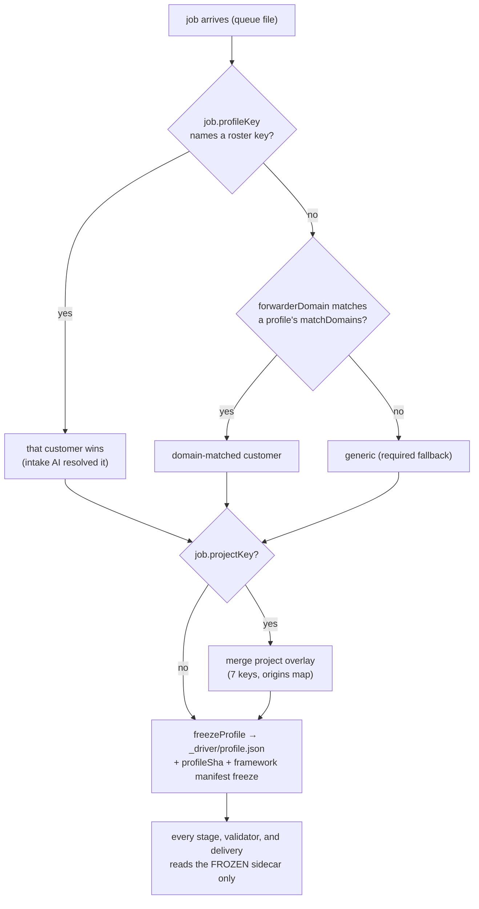

# 05 — Customer Profiles

> Part of the architecture pack (`docs/architecture/`). The driver's module tree and the headless
> integrator contract are in [`driver/README.md`](../../driver/README.md).
> This chapter describes the profile *mechanism*. Real customer bundles load from an external store
> via `CLEAROTRON_CUSTOMERS_DIR` and no customer is named here; the repository ships `generic` plus the
> synthetic demo customers `aurora`, `zephyr` and `petcary` — see
> [`driver/profiles/`](../../driver/profiles/).

One engine, never forked — three layers. The reasoning core is shared by every client; the client
context sharpens judgment without ever overriding it; the delivery layer shapes presentation only.
The profile system is where that principle is *enforced*, not just stated: every per-client knob is
either consumed by named code or rejected at load, and configuration that attempts to move a legal
rating is refused by pattern guards and by stage-level firewalls.

## The bundle

A customer = one git-owned JSON file `profiles/<key>.json`, plus optionally: a prose context pack
(`<key>.context.md`), a per-customer rating framework pair in `skills/prelim-search/`
(`risk-framework-<key>.md` + its `.manifest.json`, plus worked examples), and per-engagement
project overlays under `profiles/projects/<key>/`.

**The closed key set — exactly 16 keys** (`KNOWN_PROFILE_KEYS`, `profiles.mjs`); any other
key hard-fails at load ("every profile key must have a live consumer"). Each one names the code
that reads it in `FIELD_CONSUMERS`, and CI asserts the manifest and the key list are a bijection:

| Key | Layer | What it drives |
|---|---|---|
| `name` (required) | identity | Anchor for the self-exclusion gate (`applicantMatchesProfile` — word-boundary containment, so "Company" matches "Company Corporation" but not "Companyish Ltd") |
| `matchDomains[]` | identity | Forwarder-domain fallback resolution; cross-file overlap is a load error (directory order must never decide a customer) |
| `platforms[]` (required) | structural | The store domains the marketplace grid sweeps, verbatim — dictated into the worker spec and enforced by the receipts join. Bare domains only, no `"web"` (the general-web cell is implicit), no duplicates: a one-character slip bricks every run under the profile, so load guards are strict |
| `defaultClasses[]` / `defaultJurisdictions[]` | structural | Matter-frame defaults when the request names none |
| `selfExclusionOwners[]` | structural | Never flag the client against itself — seeded only when the job's applicant *is* the profile customer |
| `marketplaceDensity` | structural | `sparse` (default) or `dense` — selects the grid cell budget (98 vs 16 cells/call, both calibrated from real truncation incidents) |
| `industry` | context | Sector context in the matter frame — context, never a rule |
| `riskAppetite` | context | Prose posture only; reaches **curation stages only**, never synthesis |
| `delivery` | delivery | `{email: "summary", privileged: bool, style: prose, template: closed-enum}` — presentation only. `email` is inert as of 2026-07-28 (every run gets a cover note); `"table"` is accepted-but-retired so stored profiles keep loading |
| `frameworkPath` | rating authority | The customer's own risk framework deck; absent ⇒ the Generic default rates the matter ("nothing in between") |
| `workedExamplesPath` | context | Per-customer synthesis depth target |
| `defaultProduct` | entitlement | Which search runs when a request names none (`search-policy.mjs`). May be unset — a clearance that names no product is then named by its own resolved territories |
| `allowedRecipes[]` | entitlement | The closed menu of searches this account may trigger; absent ⇒ everything allowed. Non-empty when present |
| `jxPolicy` | entitlement | The native-language deepening posture (declared lanes, escalation, provider stance) — policy, never capability. Frozen into the run sidecar so a resume keeps it |
| `runCaps` | admission | Per-account admission caps `{maxQueued?, dailyRuns?, monthlyRuns?}`, integers 1–10000, at least one set. Enforced at the runner's claim chokepoint for **both** intake doors (email and portal) — the run-slot cap does not bound a client that can trigger its own searches. **Two behaviours it is worth knowing before you rely on a cap** — see below |

**Two `runCaps` behaviours to know before relying on a cap** (`checkRunCaps`, `driver/runner.mjs`):
**a cap written onto `generic` does nothing** — it is exempt by design, so a long-lived credential
pointed there spends without limit; and a client run with no `dailyRuns` gets
`DEFAULT_CLIENT_DAILY_RUNS`, not unlimited.

**Derived, never stored** (storing either is its own louder load error): the grid floor
`minCellsPerVariant = platforms.length + 1` and `batchSize = gridCellBudget / floor`.

**The context pack** is deliberately a sibling *file*, not a JSON key (so the deny-unknown-key gate
never sees it): curated background facts, standing concerns, prior-matter learnings. Capped at
8,000 chars, and guarded against rule shapes — imperative ratings, absolutes, if-then-rating
conditionals are rejected at load; the fix is to rephrase the rule as a concern or question. It
feeds `report-overview` as context that "NEVER changes a band" and never reaches synthesis.

**The framework layer** (`framework.mjs`) is where per-client rating vocabulary lives. The
framework itself is a prose deck the model reasons *with*; the code-side manifest
(`<framework>.manifest.json`) carries **vocabulary and order only** — 2–8 ordered bands, each
`{label, tone}`, no digits in labels ("a numbered band is a score in disguise"), and structurally
*cannot* express a mapping table, threshold, or decision rule. Every shipped deck⇄manifest pair is
CI-linted, every profile's framework selection must resolve to a manifest, and bands-shaped decks
are checked to carry no legacy scoring machinery (`test/framework-lint.test.mjs`).

> **Per-customer decks legitimately diverge, and no test forbids it.** There is no
> "doctrine-lockstep" check keeping rating tables byte-identical across customer frameworks: the
> framework in force is what *rates* the matter, so divergence is the point. The integrity guarantee
> is elsewhere — closed manifests (vocabulary only), the anti-rule guards below, and the
> framework-lint suite (`test/framework-lint.test.mjs`). Code comments in `stages.mjs` still
> reference a `doctrine-diff.test.mjs`; that file does not exist.

**Project overlays**: `profiles/projects/<customer>/<slug>.json` is a *sparse* overlay. The 16 keys
split 8/8 and every future field must choose a side (`PROJECT_KEYS ∪ CUSTOMER_ONLY_KEYS ===
KNOWN_PROFILE_KEYS`, asserted by test). **Overlayable (8):** platforms, defaultClasses,
defaultJurisdictions, marketplaceDensity, delivery, riskAppetite, industry, defaultProduct — a
distinct engagement legitimately runs a different product and different marketplaces.
**Customer-only (8):** name, matchDomains, selfExclusionOwners, frameworkPath, workedExamplesPath,
allowedRecipes, jxPolicy, runCaps — identity, rating authority and entitlement stay whole-customer,
and a project that could widen its own caps would hollow out the customer's. Effective resolution
merges project → customer → generic with a per-field `origins` map frozen into the run.

## Resolution and the frozen sidecar

Three rules make this trustworthy:

- **The intake AI resolves *who*; code is the deterministic floor under it.** `job.profileKey`
  (stamped by intake) beats domain matching; `job.customer` (the free-text applicant) never selects
  a profile — it only activates self-exclusion when it matches the profile's `name`. An unknown
  `profileKey` is caught at intake validation (clarify), so the generic fallback only fires on a
  deleted-profile edge.
- **Resolve once, freeze, never re-derive.** `_driver/profile.json` is written before any spend; a
  profiles/ edit mid-run can never change a live run's floor or platforms; resume/experiment
  and every validator read the same immutable file; a corrupt sidecar crashes loudly. `profileSha`
  (canonical-JSON sha256) makes "which profile/framework rated this run" verifiable by recompute.
  A mid-run late-bind of the customer re-classifies findings only — it never re-resolves the
  profile.
- **An unbound run can never be presented customer-framed.** No key + no domain ⇒ generic ⇒ neutral
  delivery (no client table, no privileged header) — pinned by test.

## The guardrails

| Guard | Mechanism | Where |
|---|---|---|
| **Closed key enum** | Unknown key → hard load failure; no dead knobs | `profiles.mjs` + tests |
| **Consumer manifest** | `FIELD_CONSUMERS` names the `{file, symbol}` consuming every field; CI greps the symbol out of that file and asserts manifest ⇄ key-list bijection | `profiles.mjs`, `test/profiles.test.mjs` |
| **Anti-threshold guard** | `riskAppetite` (and context pack, and delivery style) reject numeric/threshold/rule shapes at load — percentages, comparison operators, "threshold", level/composite cutoffs, imperative ratings | `profiles.mjs` |
| **The D1 firewall** | Stage messages decide which stage *sees* what: synthesis gets framework + worked examples and **no** appetite/pack/style; the three curation stages get them labelled "emphasis only / NEVER changes a band" | `stages.mjs` |
| **Framework manifest constraints** | Vocabulary + order only; no digit labels; closed keys; 2–8 bands; deck⇄manifest lint | `framework.mjs`, `test/framework-lint.test.mjs` |
| **Freeze completeness** | A configured field must be carried by `freezeProfile` or it is silently never applied — the exact 2026-06-19 bug (frameworkPath dropped from the freeze quietly rated two customers under the Generic default); regression-pinned | `pipeline.mjs`, `test/framework-freeze.test.mjs` |

Honest boundary: the regex guards are conservative-reject and *necessary, not sufficient* — a
pure-prose rule can pass them; the evaluation layer (reference library / review) is the catch for
that class, by design.

## The profile service (config UI)

A small loopback HTTP service (`profile-service.mjs`, systemd user unit, `PROFILE_PORT` — default
18794) serving the profile editor page published into the pool. It runs from a systemd user unit,
which carries the deployment's own directories and is therefore part of a deployment rather than of
this source tree.

- **Endpoints**: roster list, per-customer view (config + derived values + framework box), validate
  (server-side dry run), save (validated **auto-commit** — creates or updates the JSON + context
  pack and commits authored as the signed-in identity), health (unauthenticated liveness), plus the
  project endpoints.
- **Auth chain**: loopback bind → tunnel → auth proxy (IdP) → reverse proxy → the
  service **re-verifies the proxy's JWT on every request** (team + audience + allowed email
  domains), rate-limits per identity, caps body size. Fail-closed: missing team/AUD refuses to
  start; disabling auth requires an explicit dev flag *and* loopback. Details in
  [09 — Security](09-security-and-data.md).
- **Server-enforced rules**: the git author and audit line always come from the verified identity
  (a body-supplied author is ignored); every write re-runs the *same* load-time validators the
  driver uses, so the UI can never persist a profile the driver would reject; and
  `frameworkPath`/`workedExamplesPath` are **code-owned** — the on-disk value always wins because a
  2026-07-04 UI save once silently stripped both fields and flipped two customers to the Generic default
  framework (`preserveCodeOwned`, `profile-service.mjs`).
- **Governance posture**: UI saves are validated auto-commits with no PR gate. Recovery is
  `git revert` plus the audit log (`profiles/_audit.log`, git-tracked). In-flight runs are
  unaffected (sidecar freeze); changes ship to the next run.

## Onboarding a new client — the runbook

**Path A — git PR** (the bespoke-engagement default):

1. Author `profiles/<key>.json`: key matching `^[a-z0-9][a-z0-9-]{1,38}$` (`generic` reserved);
   their marketplaces as bare store domains; default classes/jurisdictions; own/affiliate entity
   names; industry; density (`dense` for byte-heavy retail); delivery; appetite prose. Optionally
   `<key>.context.md` (≤ 8,000 chars; facts, concerns, questions — no rule shapes).
2. PR review — every field is read by code, so review it like code.
3. **Rewrite check** for a new industry: read the common-law and register skills plus the stage
   message prose — the skills are platform-agnostic and follow the dictated list, but worked
   examples carry historical industry flavour.
4. One validation run on a known or synthetic matter: confirm the grid swept exactly the profile's
   platforms (the receipts gate enforces this), the defaults landed in the matter frame, and the
   report reads right.
5. Merge + deploy.

**Path B — the config UI**: sign in through CF Access → "+ New customer" → fill the form →
"Check first" (dry-run validate) → "Save" (validated auto-commit + audit line).

**Either path, afterwards:**

- **Routing**: intake stamps `job.profileKey` (the primary selector); optionally add
  `matchDomains` for forwarder-based fallback. A profile with empty `matchDomains` is reachable by
  profileKey only.
- **Per-customer framework** (optional; git-only, legal-team work — the UI cannot set it): add the
  deck + manifest + worked examples under `skills/prelim-search/`, set the two paths in the profile
  JSON via git. Until then the customer rates under the Generic default.
- **Per-engagement overlay** (optional): `profiles/projects/<key>/<slug>.json` with the 8
  overlayable keys; intake stamps `job.projectKey` to select it.

## Maintainer gotchas

- **Adding a profile field is a four-place change**: `KNOWN_PROFILE_KEYS` + `FIELD_CONSUMERS` (with
  a greppable symbol) + the `PROJECT_KEYS`/`CUSTOMER_ONLY_KEYS` split (the bijection test fails
  otherwise) + **`freezeProfile`** — miss
  the freeze and the field is configured-but-never-applied. If the UI form doesn't carry it, also
  handle the save round-trip (`defaultWriteProfile` rewrites the whole file; that's the bug class
  `CODE_OWNED_FIELDS` exists for).
- `frameworkPath`/`workedExamplesPath` are frozen **raw** (no `?? ""`) — an empty string would
  defeat the Generic-default fallback.
- The page's client-side key/domain regexes deliberately mirror the server guards — change them
  together. The page fetches `/profiles/` *with* the trailing slash (the proxy matcher requires it).
- An empty context-pack textarea on save **deletes** the sibling `.context.md` (recoverable via git).
- Profile load caches at module level; the service always force-reloads, the driver does not — fine
  for the oneshot driver, a trap in long-lived test processes.
- The `delivery.template` closed enum (one entry today) is the un-park point for a real second
  report format — distinct from the parked multi-HTML-template family, despite the similar name.
