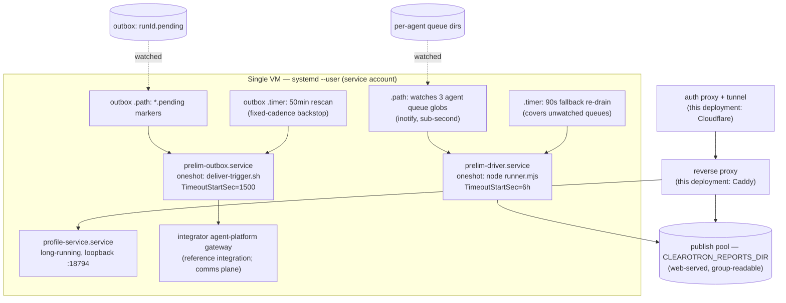

# 06 — Operations Runbook

> Part of the architecture pack (`docs/architecture/`). The driver's module tree and the headless
> integrator contract are in [`driver/README.md`](../../driver/README.md). To install and configure
> a deployment of your own, start from [`INSTALL.md`](../../INSTALL.md).
>
> This chapter describes running the engine on a single host that also carries an integrator agent
> platform — the reference shape the units in `driver/systemd/` are written for. The deploy
> *tooling* that installs them (an `ops.sh` dispatcher and its `deploy.sh`) belongs to that
> deployment and is **not part of this repository**; where it is named below, read it as "whatever
> installs your units", and see the requirements list under [Deploy](#deploy).

Everything here runs as **systemd --user units of one service account** (no root units, no `User=`
directives); `%h` is that account's home. The load-bearing operational fact: the unit files are
**repo state**, reinstalled by every deploy, so hand edits to the live copies silently self-revert
(§ "never hand-edit").

## Runtime inventory



| Unit | Trigger | Execs | Key settings (why) |
|---|---|---|---|
| `prelim-driver.path` | new `*.json` in the **three explicitly listed** agent queues | `prelim-driver.service` | A new agent workspace is only covered by the timer until this unit gains a glob line + deploy |
| `prelim-driver.timer` | boot+2min, every 90s | same | Self-healing backstop; atomic claims mean a re-drain can never double-run |
| `prelim-driver.service` | (path/timer only — not `[Install]`ed) | `node runner.mjs` | `Type=oneshot` (single instance guaranteed); `EnvironmentFile=%h/.env`; `StartLimitIntervalSec=0` (a gateway outage must not lock the unit out); **`TimeoutStartSec=6h`** — a ceiling for a *wedged* runner only; honest drains are bounded by the runner's 2h admission budget (`CLEAROTRON_ADMISSION_BUDGET_MS`) + one run's wall. Change the two together: a 6h unit ceiling under a longer admission budget kills honest drains |
| `prelim-outbox.path` | `*.pending` in the outbox | `prelim-outbox.service` | Level-triggered: re-fires while any marker exists — the script's pacing sleep is load-bearing |
| `prelim-outbox.service` | (path/timer) | `driver/deliver-trigger.sh` | **`TimeoutStartSec=1500`**: one hung wake once wedged the lane 19h (the CLI finished its turn but never exited); with a real ceiling the unit self-heals. The 1500 s covers the worst legitimate wake end to end — the script's own `timeout 840 --kill-after=30` wall, plus its drain wait (180 s) and its pacing sleep (≤300 s). Change them together |
| `prelim-outbox.timer` | boot+10min, every 50min | same | Rescan for owed sends (`sendPending` true, no `.sent`); self-defers while the instant lane is busy |
| `profile-service.service` | long-running | `node profile-service.mjs` | Loopback :18794 behind the reverse proxy and auth gate (this deployment: Caddy + Cloudflare Access); deliberately **no** `EnvironmentFile` (least-privilege; pins its own non-secret audience identifiers) |

**"Activating" for hours is normal** on `prelim-driver.service` during a multi-job drain — oneshot
semantics put the whole drain inside the activating state. Do not add `Restart=` or a start limit;
the unit comments and tests pin why.

Delivery truth lives in the run dir, not the marker: `status.sendPending` + the `.sent` sentinel
make wakes idempotent — a lost marker can delay a send (≤50 min), never lose or double it.
A marker naming no routable agent is moved to `<outbox>/quarantine/` on sight — payload kept, outside
the `*.pending` glob (leaving it in place would keep the level-trigger firing with no agent able to
settle it).

## Deploy

This repository ships the unit files (`driver/systemd/`, seven of them) and the delivery trigger
(`driver/deliver-trigger.sh`); it does not ship the script that installs them. Whatever plays that
role on your host — a dispatcher, a config-management run, a hand-written script — owes the
properties below, each of which was learned the expensive way:

1. **In-flight guard** — refuse to deploy while a run is queued, claimed or in flight: deploying
   mid-run feeds one expensive run two different skill versions. **Call
   check that nothing is in flight and abort if anything is** — read every queue this
   deployment would drain plus the run-slot locks, and refuse on any of them. `--override
   "<reason>"` is the owner-ordered exception; the reason is printed into the deploy output, and a
   blank one exits 2 rather than passing. This step used to be a line of prose asking a human to
   check, which is not a guard on the night it matters. Then **stop the four trigger units** for
   the deploy window and install an **EXIT trap that restarts them on every exit path**, success or
   abort — trap *after* stop, or an early abort leaves the machine silent.
2. **Skill scanner gate** over `driver/skills/` — the tree the driver actually reads — and over any
   skills tree your integrator carries. Abort on high/critical findings, and if the scanner is
   absent say so loudly rather than passing: a gate that cannot run is not a gate that passed.
3. **Drift detection on live agent workspaces** — abort on local skill edits rather than promoting
   them; silent auto-promotion twice resurrected intentionally deleted files. A skill relocated into
   the driver tree is relocation, not drift.
4. **Driver block** — install dependencies, copy the seven unit files + `daemon-reload`,
   install/enable/restart the sibling services (profile-service, client access/MCP), and
   **pre-create the queue dirs and the outbox**: an inotify `.path` watch on a directory that does
   not exist never fires.
5. **Restart the gateway last**, with no live run and the triggers stopped, then re-enable the four
   trigger units.

### Never hand-edit (a deploy overwrites these silently)

- Installed unit files in `~/.config/systemd/user/` → edit `driver/systemd/*` + deploy.
- Agent workspace skills / shared files (rsync `--delete` + drift abort).
- Staff pool pages (regenerated from code).

Not owned by the deploy at all — inventory these per deployment: the reverse-proxy routes, the auth
proxy's own access apps and audience identifiers (on this deployment, Cloudflare Access apps/AUDs),
and the environment file holding the secrets.

## Restarts and upgrades

- **Gateway restart** must **refuse while a run slot is held by a live pid**: a mid-run restart cuts
  in-flight comms turns, and a restart inside the delivery window once silently degraded a send to
  the multi-hour backstop. Keep a `--force` escape for a genuinely wedged gateway. Check
  `/proc/<pid>` existence rather than `kill -0` — a cross-user pid reads as dead under `kill -0`.
- **A scheduled gateway restart** (chat-channel session and plugin-loader hygiene) should *defer*
  off live work rather than skip: wait while a run is live, up to a bound, then restart anyway.
  `XDG_RUNTIME_DIR` must be set for `systemctl --user` to work from cron.
- **Integrator-platform upgrades** go through that platform's own guarded upgrade path — dry-run,
  exact-version confirm, stop → update → start. Never `npm i -g` / `pnpm add -g` directly.

## Monitoring — where to look

| Surface | What it tells you |
|---|---|
| `systemctl --user status prelim-driver.{path,timer,service} prelim-outbox.{path,timer,service} profile-service` | Trigger health; remember "activating = draining" |
| `journalctl --user -u prelim-driver.service -f` | Runner notes (stderr): claims, dedup parks, preflight failures, orphan reclaims |
| Run dir `status.json` / `run.jsonl` | Per-run state + the append-only decision trace; grep keys: `axes`, `profile`, `verdict`, `escalation`, `postponed`, `delivered`, `profile-mismatch` |
| `_driver/<stage>.jsonl` | Per-attempt telemetry: status, fail token, kill signals, wall, tokens |
| Queue dirs | Marker states at a glance ([03 §2](03-run-lifecycle.md#2--claim-identity-and-crash-safety)): `.json`, `.processing` (+`.skips` — a growing skip tally is the wedge signature), `.postponed`, `.duplicate`, `.done`, `.failed` |
| Staff pool pages (`index/status/profiles.html`) | Human-facing run status; regenerated each deploy |
| Ops recurrence digest | `node driver/repair-digest.mjs --days 7` — worth running on a schedule and mailing to whoever owns the box |
| Ledgers | Provider-call ledger (billable register calls, retries, errors), token rollup per run |
| `gate-metrics.mjs <archiveRoot>` | Holdout quality metrics (operator CLI; the module's `documentGrowth` export is also read on a live run — see [07 §5](07-quality-and-audit.md#5--observability-that-refuses-to-be-a-gate)) |

## Queue administration — common interventions

All job markers live in the forwarding agent's queue dir; prose sidecars sit beside them and
survive until terminal state.

- **Force a duplicate to run**: a `.duplicate` renamed to `.json` will just re-park (the matter
  ledger still matches). The supported path is re-enqueueing with `dupOverride: true` in the job
  JSON — it skips the gate but still records the matter.
- **Resume a parked run early**: `.postponed` auto-resumes when due (`resetsAt`, else 20 min
  backoff). To force: `node pipeline.mjs --resume <codename>` as the service account (takes a run
  slot like any run; clears the stale park).
- **A stuck `.processing`**: check the `.pid` sidecar (`<pid>:<starttime>`) — a live claimer is
  skipped by design (`.skips` counts the observations); a dead one is taken over automatically next
  drain. The 48h claim-age ceiling re-claims regardless of liveness. Don't hand-rename `.processing`
  while its claimer lives: the codename meta is what prevents a double-spend.
- **Manual runs** (always as the service account; they take the run slot):
  `node pipeline.mjs --job <file.json> [--agent <id>]`, `--resume <codename> [--from <stage>]`,
  `--resume <codename> --experiment <stage>` (shadow dir, usage excluded from run attribution).
  A `.delivered` run refuses resume — use `--experiment`.
- **A failed run**: `.failed` + `_driver/failure.json` carry stage, reason, class, signature. After
  fixing the cause, `--resume <codename>` — completed stages skip on file truth. Repeated re-parks
  hit the circuit breaker (3) and go terminal loudly.

## Incident patterns

| Signature | What it is | Response |
|---|---|---|
| Runner exits 3 repeatedly, work queued | Gateway down (preflight fails) | Fix/restart gateway; the 20s pre-exit hold + StartLimit=0 keep systemd healthy meanwhile; an *empty* queue during an outage shows no failures at all (idle fast-path) |
| Stage failures with `rate_limited`, runs flip to `.postponed` | Provider 429 (subscription cap or API limit) | Nothing to do — parks auto-resume at `resetsAt` (or +20 min). Recurring under load ⇒ consider API-key auth mode ([04](04-configuration-reference.md)) |
| `status_overloaded` breaks a ladder after one attempt | Provider 529/overload | By design (don't hammer); recovery parks own the re-attempt |
| Delivery not sent, `.pending` marker present | Wake failed | The unit's 1500 s ceiling + the level-trigger + the 50 min rescan self-heal; check `outbox-backoff` sidecars for a failing agent; verify the gateway |
| Run parked with `*.tainted-N` artifacts | Timeout-taint convergence loop ([07 §3](07-quality-and-audit.md#3--completed-coverage-honesty-in-code)) | Let it converge; repeated signature goes terminal honestly |
| Chat failure ping never arrived for a failed run | By design: nothing here sends. The failure packet IS the notice, and an integrator consumes it | Check `_driver/failure.json` + the outbox lane (the guaranteed notice) |
| Deploy refused because a run is in flight | The in-flight guard above | Wait for the run. A force-restart of the gateway is not the answer — that is for a wedged gateway |
| Everything quiet after a deploy abort | Should not happen (EXIT trap restarts triggers) — if it does: `systemctl --user start prelim-driver.{path,timer} prelim-outbox.{path,timer}` and file it |

## Selftest — retired

`driver/selftest.mjs` is deleted. Four of its five probes drove an integrator platform's agent gateway
directly — blocking-return, waiting through reasoning, a four-way concurrency race, model-alias and
admin scope — and its own note said in as many words that they validated the **comms/gateway** linchpins
rather than stage compute. That gateway is no longer part of the product, so the probes had nothing left
to probe and the file went with them. Nothing invoked it: not `package.json`, not `bin/`, not
`scripts/`, not a unit, not CI. It was run by hand, and it spent real money when it was.

What replaces each half: the free path check is `npx clearotron doctor` plus the runner's own preflights
(`preflightEngineBinary`, `preflightCredentials`, `preflightDeploymentUrls`), each of which refuses by
name before a run dir exists. The billable half has no replacement and needs none — stage compute is
exercised by real runs and the A/B harness, which is what its own note already said.

## Storage care

- **Run archive**: delivered runs move whole into `<archive>/<YYYY-MM>/<slug>/`; the pool and
  archive grow monotonically. No automated retention exists — capacity review is a routine
  operational task.
- **Pool permissions**: the pool root is set-GID (mode 2750, web-server group); run dirs inherit
  it automatically and files are written 0640. **Never chmod a pool run dir**: the service account
  is not in the web-server group, and POSIX silently strips the set-GID bit when a non-member
  chmods — new files then fall to the wrong group and every report 403s (this was a real
  incident; the offending chmod was removed 2026-06-08).
- **Pool curation** is `publish/pool-admin.mjs` (run as the service account):
  `list`, `archive`/`unarchive`/`archive-only` (visibility tags in `archive-tags.json` — never
  deletion), `regen` (re-render indexes/pages), `link-home`, `backfill-issued`, and
  `republish <runId>` (full re-render of an archived run from its workspace archive). Every
  mutation except `link-home` regenerates the same index + staff surfaces publish does — `link-home`
  only rewrites each run's `report.html`.

### The register ledgers — one per run, one per box, and why the split

There is **no ledger cleanup job and nothing to schedule**. If you are looking for
`bin/register-ledger-prune.mjs`, `npm run prune:ledger` or `CLEAROTRON_REGISTER_LEDGER_MAX_BYTES`, they are
gone: the file they bounded no longer grows.

| | where | holds | lifecycle |
|---|---|---|---|
| `<run>/_driver/register-record-bodies.jsonl` | **in the run** | the **body of every official record fetched** by that run | created, archived and purged with the run |
| `~/trademark/telemetry/register-calls.jsonl` | box-global | one small row per provider call | kept — the billing record, read across runs |

**The record bodies moved into the run because that is where they belong.** A register response is
evidence for one run's report, is verified against that report, and is archived with it. Held globally
it was append-only for the life of the box — production reached 432 MB in 61 days, test 2.0 GB — and
bounding it took a rotation timer that every deployment, including every open-source install, had to
set up. It also sat under the account's home, which on a typical single-host deployment is the root
filesystem; the run directory is under `CLEAROTRON_WORK_DIR` with the rest of the run, which a
deployment can point at a volume that has room (the disk preflight names that variable when it
refuses to start a run).

**The call ledger stays global, and that is what keeps the move honest.** A run-scoped record log is
empty on every fresh run, so "nothing was fetched" and "the bodies went somewhere this reader never
looks" would produce an identical file. The call ledger records that a `record_fetch` happened under
this run's prefix whatever became of the body, so the driver can compare the two: successful fetches
whose body is missing from the run's record set are reported as a **failure**, never as a clean zero
(`[records] N record fetch(es) succeeded this run and their bodies are NOT in the run's record set`).
An unreadable call ledger is reported too — losing the witness is itself a finding.

**Clearing a run's record log retroactively unverifies that run's findings.** A delivered report that
says a registration number, filing date or status was checked against the official record joins against
a row in there. What makes that survivable is that the log is a **hand-off buffer, not the durable
copy**: `assembleRunRecords` unions it into the run's `_records/` and writes the union back, so once a
run has assembled, its records are self-contained in its own directory.

**Upgrading a box across.** The old global record file is still on disk and is written by nothing
and read by nothing. The driver says so once per process on stderr, naming the path and its size.
Archive it once — `mv` it aside — at your convenience; no code reads it, and there is deliberately no
fallback that would.

That last sentence was not true until.`driver/engine/mcp/gather-config.mjs` kept a box-global
arm for a register server built with no run dir, so following this instruction could have moved record
bodies a run still owned. The arm is gone: a register server without a run is now refused outright,
because omitting the variable would not have helped — `providers/_shared/ledger-path.mjs` resolves by
existence and an unset path walks straight back to the same file. Archiving is safe to follow now, and
the measurement that says so is.

A box upgraded across the rename keeps whatever NAME its **call** ledger already had
(`corsearch-calls.jsonl`), and across the move keeps whatever DIRECTORY it sits in (the
pre- telemetry directory), because the resolver reads the file that is there. Read
`providers/_shared/ledger-path.mjs` to see which of the four candidates a box resolves to.

## Access control and instance isolation

Three capabilities you meet once the engine produces reports other people want to see. Each is off,
or single-tenant, until you configure it.

### Tenant grants — who may see which runs

`CLEAROTRON_ACCESS_FILE` names one JSON file: the guest list. It maps **tenants** (an organisation) to the
**accounts** they may see, and users within a tenant to a subset of it. An account key is a
`profileKey` — the customer bundle a run froze at start (§4) — so a grant is expressed in the same
vocabulary as the runs it filters.

**Unset means enforcement is off for the MCP faces** — whoever gets through your door sees every run.
**It is not a valid state for the portal, which refuses to start without a guest list**; the access
model is stated once, in [docs/SECURITY.md](../SECURITY.md). Setting the variable turns account scoping
on for **every face at once** — the portal, the MCP read face, the client face, and ops tokens. There is
no half-enforced state and no per-surface switch to forget.

Resolution: the signed-in email is matched against each tenant's `users` map, by exact address or by
a `*@domain` wildcard; a user value of `"*"` means the tenant's whole grant; an address appearing in
several tenants gets the union. An authenticated address matching nothing is granted nothing — it
signs in and sees an empty world. That is deliberate. Signing in is not being enrolled.

**A file that is set but unreadable throws rather than failing open.** A missing path, malformed JSON,
or a file with no `tenants` object stops the process and names the reason. Keep that in mind when you
move the file: a guest list you configured and then broke must never resolve to "admit everybody".

`examples/grants.example.json` is a working file over the synthetic demo customers this repo ships.
Copy it, point `CLEAROTRON_ACCESS_FILE` at your copy, sign in as one of its addresses, and you see
exactly that tenant's accounts. Then delete it and write your own — it names nobody real, which also
means it grants nothing you have.

`npx clearotron start` (§6) writes an empty roster (`{"tenants": {}}`) into its state directory: your own staff
address is admitted, no client is enrolled, and enforcement is already on.

### Ops tokens — a credential for the verbs that spend

Reading a finished run needs no token beyond the identity your edge proves. The seven write verbs do:
`start_run`, `stop_run`, `feed_context`, `mark_sent`, `ack_event`, and the two `what_if_*` sandbox verbs
that never leave stdio. They write into the data plane, and `start_run` bills a real search — so an
automated caller gets a credential minted for it rather than borrowing a person's.

```
node mcp-server/mint-token.mjs --scope ops --sub <principal-name> \
  --verbs start_run,feed_context --ttl-days 30
```

- `--sub` names the principal, and it rides into every audit line. Two integrations holding ops
  tokens are then distinguishable in the log; one shared token makes them permanently indistinguishable.
- `--verbs` is a least-privilege allowlist of write tools. A connector minted without `stop_run`
  cannot call it — the check sits at the one chokepoint every tool call passes, not in each tool.
- `--accounts` caps the token to a set of account keys, so a trial integration can start demo
  searches and never a real customer's.
- The token is printed once and stored nowhere. Losing it means minting another.

**Revoking one.** Every mint prints a `jti`. Write that line into the file named by
`TRADEMARK_MCP_TOKEN_DENYLIST` (one `jti` per line, `#` comments allowed) and the next verification
refuses the token. A **missing** denylist file means nothing is revoked, never everything — a denylist
must not be able to take all authentication down.

**Rotating the signing secret.** Verification accepts `TRADEMARK_MCP_TOKEN_SECRET` or
`TRADEMARK_MCP_TOKEN_SECRET_PREVIOUS`; minting always signs with the current one. Move the old value
to `_PREVIOUS`, set a new current, and clear `_PREVIOUS` once the longest outstanding TTL has expired.
No flag day, and no live token dies mid-window.

Ops sessions also ride their own rate bucket keyed on `--sub` (`TRADEMARK_MCP_OPS_RATE_PER_MIN`),
underneath the per-identity limit that applies to people, so a runaway connector throttles itself
rather than your staff.

### Two instances on one machine — what keeps them apart

A test instance and a live one are **the same code with different environment**. Nothing else
distinguishes them: there is no build flag, no profile constant, no mode switch in the source.
`.env.example` is the full variable catalogue and the starting point for either.

That makes the environment the whole isolation boundary, so set it to make a test instance
*incapable* of reaching live data rather than merely aimed elsewhere:

| Axis | Variables | Why it is structural |
|---|---|---|
| Data plane | `CLEAROTRON_REPORTS_DIR`, `CLEAROTRON_WORK_DIR`, `CLEAROTRON_QUEUE_DIR`, `CLEAROTRON_OUTBOX_DIR` | separate directories mean a test run cannot publish into the live archive even by mistake |
| Customer configs | `CLEAROTRON_CUSTOMERS_DIR`, `CLEAROTRON_INSTRUCTIONS_DIR` **unset** on the test instance | it then resolves the repo's synthetic demo customers and cannot read a real bundle |
| Engine | the running engine's binary variable (`CLEAROTRON_CLAUDE_PATH` / `CLEAROTRON_CODEX_PATH`) pointed at `driver/test/mock-claude.mjs` | the mock engine needs no provider credentials, so a test instance can hold none — the strongest form of "spends nothing" |
| Ports | give the test instance its own for the portal, MCP face and profile service | a default that collides with a live service turns a dry run into a probe of the live one, and it looks like it worked |
| Auth | `TRADEMARK_MCP_AUTH_DISABLED=1` with `TRADEMARK_MCP_DEV=1` is **loopback-only, enforced in code** | the switch cannot be used to open a remote face |

The strongest isolation is still two instances with their own pool and their own config store. Tenant
grants above are for the case where one instance must be shared safely — demos, trials, per-user
scoping inside one firm — not a substitute for this.
