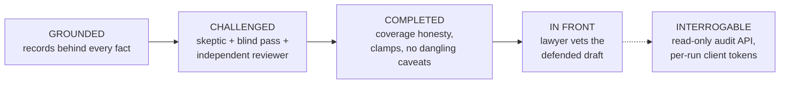

# 07 — Quality and Audit Machinery

> Part of the architecture pack (`docs/architecture/`). The driver's module tree and the headless
> integrator contract are in [`driver/README.md`](../../driver/README.md).

This chapter is the answer to "prove it": how the system makes hallucination structurally hard,
challenges its own drafts, states coverage honestly, and leaves a trail an auditor can walk without
taking anyone's word. Outwardly these are the four checkpoints — *grounded, challenged, completed,
in front* — plus the memory that keeps quality from drifting. Inwardly each is a set of code
mechanisms, listed here with their real names.

Four postures govern all of it:

- **Flag-and-deliver.** Quality checks never silently withhold the internal report; defects ship as
  visible flags. The deliberate exceptions — where the run *does* stop — are enumerated below.
- **Replay purity.** Every new gate keys on a driver-written receipt being present, so re-running
  validators over archived runs can never flip old verdicts (one deliberate exception, noted).
- **Fail loud on driver-written state.** A frozen sidecar that is present-but-corrupt is a bug and
  crashes the run; absent means legacy and the gate stays off.
- **The Goodhart guard.** Observability instruments (tripwires, rule-shape, reviewer coherence) are
  read by humans and never gate or trigger retries — nothing in the pipeline can learn to satisfy
  the metric instead of the principle (`pipeline.mjs`).

## 1 — Grounded: record fidelity (`registry-fidelity.mjs`, `findings-model.mjs`)

**A citation owes its record to this delivery.** Every register URI cited on a delivered surface
must have a fetched record in the run's record set (`_records/` ∪ this session's fetch ledger,
assembled by `assembleRunRecords` — the union exists because a forked run once shipped a citation
against an empty record set, a vacuous pass). Absentees get one bounded code-fetch pass at
pre-delivery; what still can't be fetched ships as a failing flag with the mechanical cause
(`pipeline.mjs`).

**The model never re-types data.** Three mechanisms keep model-typed identifiers out of
deliverables:

- `findRegistryViolations` — cited field vs fetched record: `mismatch`, `unverified` (record lacks
  the field), `unfetched`.
- `applyRegistryCorrections` — cleanly-tokenized *numeric* identifiers (registration numbers,
  filing/registration dates) are overwritten *from the record*, before and after any model redo, so
  the record-true value gets the last word; every correction is logged. Prose and status are
  deliberately out of scope (a prose rewrite is unsafe — those stay flags).
- `bindFindingsToRecords` — at publish, `findings.json` registration fields (classes, status,
  dates, jurisdiction, owner) are bound from the fetched record; a cited-but-unfetched registration
  gets its fields *nulled*, never invented.

Supporting checks: per-meter evidence status by machine join (`verified` only when the source joins
a fetched record; a register-mirror "use" source is *never* evidence of use), opposition-window
extraction from records (feeding structured deadline actions), and document-only registry
arithmetic (a registration cannot predate its own application; era-anchored plausibility windows,
generous tolerances — only impossible-on-any-reading pairings flag).

**The findings spine** (`findings.json`) is the single source of truth for delivered values: closed
vocabularies throughout (levels, dispute types, meters, dispositions, action kinds), key allowlists
enforced by hand (no JSON-schema dependency), ordinal integrity, and a count guard (`findings_empty`
— zero findings *and* zero coverage rows is a write miss, not a clean matter). A `withdrawn`
(review-killed) finding persists forever for forensics and renders nowhere — a killed card can
never resurrect. After the verdict, same-owner+same-mark findings consolidate to one conflict
(worst band wins, registrations union, ordinals renumber, actions remap; a dangling action drops
loudly). The verdict *display* derivation refuses the one catastrophic default: banded findings
with no frozen framework manifest throw rather than render a rated matter as "Low".

## 2 — Challenged: three independent challenges

**The skeptic** re-examines the gather and emits verbatim `ESCALATE: <axis>` tokens (code parses
tokens, never prose). Deliberately non-fatal: a checker outage must not bin completed work. Code
adds a floor the skeptic cannot bypass: an axis whose every ledger row is `coverage-limited` (an
accepted limit a re-run cannot close) is skipped; `deferred` and `confirmed-clean` rows escalate.

**The blind pass** rebuilds the threat picture from the raw request alone — its declared inputs are
*only* the inbound request, enforced down to the `--experiment` sandbox (listing the matter frame
would leak the run's framing into the one pass that must not see it). The frame diff turns the
comparison into structured directives; a mechanical **form-neighbourhood oracle** adds
deterministically-generated near-form gaps (edit-1 exhaustive, phonetic families via
Double-Metaphone keys) — the model may *add* candidates and rank; it may never define, shrink, or
filter the mechanical floor. Directives reopen investigation once, bounded, with per-directive
closure verified by re-running the same detector (`close-verify.mjs` — a byte-changed band with
only a wrong-scope or empty block closes nothing; that exact false-close shipped once).

**The independent reviewer** (`narrative-refutation`) re-derives conclusions from the evidence and
returns a verdict parsed by `parseVerdict` (`verify.mjs`), whose error posture is
deliberately asymmetric: negation-guarded ("NOT CLEAR" can never parse as CLEAR), most-severe-wins
on ambiguity, and **parse failure means BLOCKING** — over-grading costs a warm re-check;
under-grading ships a wrong CLEAR. The reviewer's context includes code-computed fidelity probes
and a mandatory plan-execution check. CONDITIONAL/BLOCKING triggers corrective re-synthesis, a
freshness gate proving the named corrections actually reached `findings.json`, and a warm verdict
re-check that can only fall back to the *entry* verdict. A terminal BLOCKING first gets the
degenerate-artifact refusal (a "BLOCKING" with zero cited defects is re-asked fresh, once), then
fails the run — a report the reviewer won't stand behind never ships looking finished
("delivered with open questions" is retired). The reviewer's verdict is treated as documented-noisy;
that is precisely why every *honesty* signal below derives from ledgers and receipts, not review
prose.

## 3 — Completed: coverage honesty in code

The keystone is a two-word distinction (`coverage-ledger.mjs`): **`deferred`** = the search
could not run or reach its data → a closable gap → escalate, disclose, clamp. **`coverage-limited`**
= the search ran but the field is too large/thin to exhaust → an accepted, disclosed limit → never
clamps, never escalates. Mislabels are code-corrected at the single read chokepoint
(`loadCoverageLedger`): a tool-absence signature relabels to deferred, and taint relabels
confirmed-clean rows on kill-touched axes.

What makes the coverage statement trustworthy:

- **The machine ledger is code-derived from the model's validated prose** after every digest pass —
  the model no longer authors the JSON, so prose and JSON agree by construction; a ledger that
  fails strict validation is quarantined (`.invalid.json`), never shipped.
- **The register plan** (`register-plan.mjs`) makes search *reproducible*: the model reasons once
  (variant manifest), code compiles a frozen, class-scoped query program (empty class set is a
  compile error — never an all-class flood), stores it per slug for byte-identical reuse, and
  extends append-only. Fact-set stability across re-runs of the same matter was ~0.04 Jaccard
  before this; the plan is the fix, and it is always on (its env flag was deliberately removed).
- **The named band** (`named-band.mjs`) is what crosses from mechanical search to judgment: either
  a complete enumerated slice or an honest `incomplete` crowd descriptor — never a partial list. A
  **collapsed** slice (enumerated, hits > 0, zero records) is a hard recall failure: one code
  re-execution, then the run fails. "A clean can never ship over an unsearched band" is a fan-in
  gate, not a guideline.
- **Plan⇄band identity joins** close the clean-over-unexecuted hole: `confirmed-clean` claimed over
  an unexecuted plan slice, or over a multi-term crowd without per-term accounting, is a validator
  failure with its own token. An `error:true` block joins as *missing*, never as a sanctioned crowd.
- **Timeout taint** (`register-taint.mjs`): a SIGKILLed attempt leaves partial band writes that a
  retry can "validate". Per-attempt telemetry survives restarts; a kill-touched winning pass is
  tainted unless a *superseding* fresh success (never a warm followup — a followup patches, it
  cannot launder) or the sanctioned taint re-run cleared it. Pre-synthesis, a tainted material axis
  parks the run to converge; post-synthesis it is *disclosed* — ledger relabel and verdict clamp on
  the artifacts, and `taint:<axis>` joins the failed-escalations set, which closes the client gate.
  A closed gate stops nothing (§4): it is recorded on the audit workbook, `meta.json` and the
  `machine-qc-failed` event, and the report ships carrying the clamped verdict — the disclosure ends
  at the relabel, the clamp and that record. This is the one deliberately replay-*active* gate (its
  archived regression pin is intentional).
- **The clamps** (`applyCoverageFloor`) only ever raise CLEAR → CONDITIONAL, never lower, never
  manufacture BLOCKING: live condition actions, the lawyer's own `coverage_judgment.sufficient:
  false` (sufficiency is judgment's call — code only carries it), frame residuals, register gaps
  (deferred rows ∪ taint axes ∪ material recall regressions — independent of the model's
  self-report), and in-window deadlines delivered without their dates. The verdict sidecar
  (`_driver/verdict.json`) is then the single label authority for every surface; one shared
  predicate keeps the validator and the auto-correct judging "unconditional proceed" with the same
  eyes.
- **Recall memory**: confirmed conflicts persist per mark in a workspace store
  (`_known-conflicts/`, rows are only added — never deleted or rewritten, save the machine-provenance
  `terminal` a delivered run may upgrade — human edits always win, non-Latin marks handled); the next run
  folds them in as deterministic plan probes, and a prior-confirmed conflict that neither resurfaces
  nor gets a recorded justification is a *material regression* that clamps.

Register budgets deserve one honest sentence: the per-worker call budgets in the skill prose
(enumerates, phoneme ≤ 5, image ≤ 10) are **observed, prompt-level budgets, not code-enforced
quotas** — and so is the reopen detail-fetch ceiling (`CLEAROTRON_REOPEN_MAX_FETCH`, default 150).
`reopenFetchCeiling` resolves the figure in code, then the reopen prompt builders
(`buildFrameReopenFollowup`, `buildFrameReopenRetryMessage`) interpolate it into the instruction the
model reads; nothing counts a run's detail-fetches and nothing refuses the next one. The bound that
*is* code is the executor's enumerate resource guard (`CLEAROTRON_ENUMERATE_CEILING`): it owns the page
loop and returns an honest `incomplete` descriptor for an over-ceiling band rather than a truncated
one. Calls are metered per run (billing-grade ledger), never hard-capped.

## 4 — The pre-delivery lint (`predelivery-lint.mjs`)

Pure code over the assembled deliverable surfaces before anything outward-facing. On a live run
those are the report and the composed email: there is no second client-facing artifact, and the
lint's client-summary arms are kept only so the archived corpus still replays.

Thirty-three check families (`runLint` fans out to that many `*Checks` groups; the coarser `family`
label stamped on each emitted check collapses them to 14): template integrity, orphan-reference
precision, machine-work reachability ("Only you can close these" must contain only things genuinely
client-side), counting consistency across surfaces and against the findings set, the registry
family (§1), finding-provenance cross-contamination, correction consistency (a review-withdrawn
finding can never resurrect on any surface), client-tier and overall-tier joins, verdict/actions
coherence, intake-ask completion, WIPO designation language, self-comparison.

Repair economics are engineered: failing checks on a drafting surface get one bounded warm redo
(per-card re-renders are isolated); `structural` failures (a 404 record, a missing receipt) are
excluded from redo — the anti-doomed-redo switch that stops 14-minute re-emits against an
unfixable record. Verdict incoherences get a code-first re-derive (floor + sidecar + re-lint)
before any model redo. The receipt (`_driver/predelivery-lint.json`) is always written, including
initial-failure counts (the lint-tax meter) and the artifact set with skipped stages — a vacuous
pass over inherited artifacts is visible as such.

**What actually stops what** (the exceptions to flag-and-deliver):

| Severity | Trigger |
|---|---|
| **Fails the run** | Zero readable coverage-ledger rows (the coverage-honesty floor cannot run, so no verdict can ship); core findings artifact unparseable after corrective retries; the fatal stages/gates in [03](03-run-lifecycle.md). Two things a reader expects here are **not**: an unresolved screen-gate repairs or discloses and never blocks (a per-mark coverage row + the CONDITIONAL clamp, disclosed in `_driver/screen-gate-unresolved.json` — owner decision 2026-07-22, never a dead run over a provider 404), and the client gate blocks nothing (next row) |
| **Recorded by the client gate, blocks nothing** (the gate's preflight was removed with the readiness state it chose — `pipeline.mjs`) | `evaluateClientGate` still runs its machine checks inside `publishReport` — registry arithmetic, record fidelity, correction consistency, unparseable/quarantined findings, stale corrections, failed escalations (`publish/index.mjs`, fail-closed: an evaluation error also closes). Its result lands on the audit workbook, `meta.json` and the machine-qc-failed telemetry event. **It decides nothing about who may read**, and there is no client export to withhold — a defect that changes the LEGAL ANSWER is the verdict clamp's job and rides the report as a CONDITIONAL/BLOCKING verdict, never as a warning about the document |
| **Flags, never blocks** | Everything else — recorded in the `_driver` receipt sinks and surfaced on the audit workbook / quality pages; **the rendered report carries no caveat banner** (the report a lawyer signs is clean; the receipts are the QC surface). Lint flags also never ride `report.md` front-matter (that file is copied verbatim to the client-reachable pool; a front-matter flag was a latent client leak) |

## 5 — Observability that refuses to be a gate

`reasoning-tripwires.mjs` is the mechanical net under principles held holistically in the skills:
recall floor (a live identical registration dropped in the noise rows but not carried), seed
neutrality (upstream artifacts must state facts, never grades), probative grading, matrix ceilings
(legacy scale only), status honesty (clean headline over material gaps), deadline urgency and
deadline carry, unresolved disagreements, orphan register findings, uncross-checked demotions,
recall regression. All of it lands in `_driver/reasoning-integrity.json` and surfaces on the audit
workbook and quality pages — never as a banner on the rendered report.
Two of these pure functions *also* feed the verdict clamps (register gap, deadline gap) — but via
the clamp path on ledger facts, never as a tripwire "failure". `rule-shape.mjs` (rating decided by
a cutoff instead of reasoning) and the reviewer-coherence check are the same family: instruments,
not gates. `gate-metrics.mjs` is the operator CLI that scores fixes against holdout archives; one of
its exports, `documentGrowth`, is *also* read on a live run — its trips join the tripwire set above
in `_driver/reasoning-integrity.json` and gate nothing, like every other instrument here.

## 6 — The audit trail of a run

Two audit surfaces, two sources — by design:

- **`audit.md`** is built by pure code from the *prose spine* tables (register-findings +
  common-law-findings), count-guarded (`0 findings parsed` throws) — it replaced an LLM audit step
  that produced 47 vs 69 findings on identical input. It guarantees the full list: every candidate,
  every negative result, every drop with its written reason.
- **The report and Excel workbook** render from `findings.json` (the curated, rated spine), with
  registration fields bound from fetched records at publish.

Beneath both: the decision trace (`_driver/run.jsonl` — every stage, gate action, escalation,
verdict, clamp, delivery event), per-attempt telemetry (`_driver/<stage>.jsonl` — status, fail
class, kill signals, token usage), the fetched records themselves (`_records/`, receipts indexed in
`_driver/receipts.json`), and the receipt set ([03 §7](03-run-lifecycle.md#7--run-directory-anatomy)
maps all of it). The provider-usage ledger tallies billable register calls per run (billing-grade:
counts, retries, errors, cache hits, duplicate-fetch splits), and the token rollup accounts every
attempt including retry waste — tokens only, no currency, by directive.

## 7 — The memory that keeps it honest

Three layers, from cheapest to most authoritative:

1. **The $0 replay harness** (`replay-archive.mjs`): re-runs every validator and the lint over the
   archived corpus and diffs against a snapshot; any verdict-string flip fails (exit 2). Nothing in
   `.github/workflows/` runs it, and a hosted runner could not: the corpus is real client matter that
   stays on the machine holding it, and the snapshot lives outside the git tree. So the gate is a
   hand-run convention — `--update` on main, diff on the candidate, every flip an intended fix.
   Catches structural/validator regressions; cannot see reasoning drift.
2. **Gate metrics on holdout runs** (`gate-metrics.mjs`): deferral rendering, skeptic consumption,
   scored-finding grounding, client-tier match, lint first-pass tax — a fix is accepted only if the
   metrics move on runs it never cited.
3. **The reference library**: lawyer-blessed verdicts on real matters, re-run in a **paid A/B**
   for any grade-moving change, read against the system's measured run-to-run wobble (the
   model-swap doctrine). This is the only layer that can see reasoning quality — and the reason a
   transferred copy without the library and the calibration loop would quietly decay.

## 8 — The interrogation surface (read API)

Completed runs are queryable through the trademark-artifacts MCP layer (`mcp-server/`) —
effectively the product API. Everything in the read path is deterministic code; the one
model-invoking path (`what_if_run`) shells the driver's own single-stage experiment harness into a
shadow dir.

**30 tools** (`server.mjs` `TOOL_DEFS`), split by `TOOL_SCOPES` (`shared/scope.mjs`) into 23 that
write nothing and 7 that do:

- **Read, single-run** — `brief` (the start-here plain-language briefing), `get_run`,
  `read_artifact` (with a path-traversal guard on axis names), `list_evidence` (every record
  considered, including the ones the report does not name), `list_searches` (what was looked for and
  where, empty results included — the defensibility record), `get_search_coverage`, `list_findings`
  / `get_finding` (F#/NR#/AT# ids), `trace` (provenance walk over the decision trace),
  `get_telemetry` (the *only* tool that reports model identity — a tested design invariant),
  `get_provider_usage` (recomputed live from the billing ledger, with drift detection),
  `get_coverage`, `search`, `decision_timeline`, `run_changes` (stable-cursor change feed),
  `diff_artifact` (with diff-ref whitelisting that closes cross-run path escapes), and
  `get_delivery_packet` (the run's send payload; never exposed to client tokens).
- **Read, cross-run** — `list_runs`, `search_runs`, `list_profiles`, `list_outbox_events`, plus the
  two free pre-order reads `describe_options` and `plan_run`, which resolve what a search *would* do
  without reserving, spending or queueing anything.
- **3 what-if verbs** (`what_if_plan` → cost prior + billed-call flag + confirmation token;
  `what_if_run` → one sandboxed stage; `what_if_result` → collect a queued one) — **executing** is
  local stdio only, never remote, for any principal. The confirmation token is a deliberate-action
  handshake, not a crypto boundary; the security boundary is ops scope + local-only execution.
  Since the owner's 2026-08-27 ruling a client ACCOUNT reaches all three, and `what_if_run` on that
  path ENQUEUES into `<runDir>/_experiments/_queue/` rather than shelling — `driver/whatif-worker.mjs`,
  drained by the runner, is what spawns the sandbox. Because the token is unsigned, a client call must
  also name its `runId` so the account gate fires, and the enqueue refuses a token naming another run.
- **5 ops write verbs** (`start_run` — validated atomic enqueue; `stop_run` — real cancel before
  claim, best-effort sentinel after; `feed_context`; and the integrator write-backs `ack_event` and
  `mark_sent`, which refuses to settle a send without a messageId or an explicit attestation) — ops
  scope only, never on the public connector.

One run = one self-auditing directory; the read layer adds no state of its own — it projects the
run dir and the ledgers. The auth model (four principal kinds; run-bound client tokens reaching
exactly `brief`, `read_artifact` gated to the report, and `list_findings` gated to the curated card
groups) is documented in [09 — Security and data](09-security-and-data.md).

**A signed-in client account reads the audit chain** (owner ruling 2026-08-27). The audit trail is
what makes a clearance defensible, and the person who has to defend the filing is the client's
lawyer — so `audit`, `narrative`, the record artifacts and a register axis are readable through
`read_artifact`, the raw `list_findings` path returns the AT#/F#/NR# records, and `get_run`, `trace`
and `decision_timeline` walk the decision chain. What stays internal is not the chain but the cost
of producing it (`get_telemetry`, `get_provider_usage` — the only two tools that report model
identity, which is a tested design invariant and the reason this line is cheap to hold) and the
reviewers' critique of the engine's own draft (`skepticFlags`, `seniorEyeReview` — the verdict they
produced travels, the critique does not). The projections and the argument are in
`mcp-server/lib/audit-view.mjs`; the artifact list is `ACCOUNT_ARTIFACTS` in `shared/scope.mjs`.
