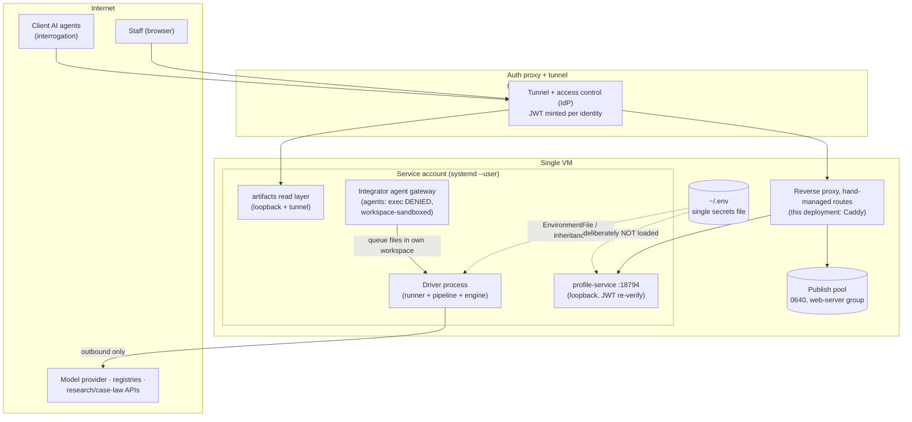

# 09 — Security and Data

> Part of the architecture pack (`docs/architecture/`). The driver's module tree and the headless
> integrator contract are in [`driver/README.md`](../../driver/README.md).

The security posture in one sentence: **nothing listens on the network except loopback services
behind an authenticated tunnel; agents that touch the outside world cannot execute anything; the
process that executes everything is not an agent; and secrets reach exactly the processes that need
them, by inheritance, never by file-copy into configs.**

## Trust boundaries

**Identity and isolation.** Two OS accounts partition the machine: a development account (repo
ownership, and a narrow `sudo` bridge that lets it invoke the deploy as the service account) and the
service account (everything runtime). Within the service account, the integrator platform's agents are sandboxed to
their own workspaces with `exec`/`bash`/`process` denied by gateway policy — an agent can *write a
queue file* and nothing else toward the driver. The driver is deliberately the opposite: a plain
OS process with cross-workspace reach, no agent capabilities, and no network listener at all. There
are no root units; everything is `systemd --user`.

## Network surface

- **Ingress** exists only through the auth proxy and its tunnel — on this deployment, Cloudflare
  Tunnel + Access: staff pages and the pool behind the access gate; the profile service and the
  artifacts read layer as loopback services behind a reverse proxy (here, Caddy). Those routes and
  the proxy's own access applications are **hand-managed VM state** (not deploy-owned) — inventory
  them per deployment.
- **The profile service** re-verifies the auth proxy's JWT on *every request* (team + audience +
  allowed email domains), rate-limits per verified identity, caps request bodies, and fails closed:
  it refuses to start without its Access identifiers, and auth can only be disabled together with
  an explicit dev flag *and* a loopback bind. Its systemd unit deliberately does **not** load the
  shared env file — it needs no production secret (the JWKS URL is the proxy's own public endpoint),
  and loading it would let another app's audience shadow its own.
- **The artifacts read layer** (`mcp-server/`) runs as three faces of one
  codebase: trusted local **stdio** (full tool set — trust boundary is the right to exec the
  binary), a **staff HTTP** face (loopback :18790 behind Tunnel + Access), and a **client HTTP**
  face (loopback :18811) that is a *separate process* with a *different Access audience* — "a
  client can never reach internal read-all" is a configuration fact, not a runtime branch (startup
  refuses if the two AUDs are equal). Auth is two-layered and fail-closed:
  - **Outer**: the CF Access JWT is re-verified at origin on every request — RS256 pinned, issuer
    + audience checked, expiry required, email claim must be a real string (array-claim smuggling
    rejected), domain matched exactly on the final `@` (subdomain look-alikes rejected).
  - **Inner**: HMAC-signed scope tokens (`v1.<payload>.<sig>`, timing-safe compare, fail-closed
    without the secret, default TTL 30 days). Four principal kinds, resolved by `visibleTools()` and
    `authorize()` in `shared/scope.mjs`: **ops** (stdio, or ops token
    over staff HTTP — reads + ops verbs; what-if only when local), **internal** (verified
    firm-domain staff — all 23 non-write tools, no writes), **user** (run-bound token minted into the
    report's "Ask your AI" link — exactly `brief` + `read_artifact` gated to the report (there is
    one report, and the link block is staff-only at serve time) + `list_findings`
    gated to curated groups, pinned to one run; filter args that could reach internal methodology
    are stripped), and **account** (a signed-in customer on the client face — their granted
    accounts' runs, reached either by the CF sign-in with no token, or by a per-person API key,
    `scope: account`, whose accounts are re-read from the grants file on every request rather than
    baked into it. Wider *reach* than a report link and, since the owner's 2026-08-27 ruling, more
    *depth* too: the audit chain — the audit trail, the reasoning narrative, the record artifacts, a
    register axis, and the `get_run` / `trace` / `decision_timeline` decision walk. Model identity
    and billed counts stay sealed (`get_telemetry`, `get_provider_usage`), as does the reviewers'
    critique of the engine's own output; the chain's prose goes through the report's own
    client-safety passes in `mcp-server/lib/audit-view.mjs`, and the artifact set is its own
    `ACCOUNT_ARTIFACTS` so that widening it never widens the forwardable report link. The same ruling
    opened WHAT-IF, and on this face it queues rather than shells: `what_if_run` writes a job into the
    run's own `_experiments/_queue/` and `driver/whatif-worker.mjs` spawns the sandbox from a service
    process, so no remote face executes the engine. The confirmation token is unsigned, so a client
    call must also name its `runId` — the account gate keys on that, and the enqueue refuses a token
    naming a different run).
    Scope resolution is positive: no token and not firm
    staff ⇒ 403 — the old silent default-to-internal was a real bug, now regression-pinned.
    The API-key door is a fourth process (loopback :18812) with **no Access in front** — the trade is
    explicit: a mandatory key replaces the browser sign-in, and the mode refuses to start if anything
    that would weaken that (the dev auth-disable knob, a missing signing secret) is also set.
  - The staff unit is systemd-hardened (`NoNewPrivileges`, `ProtectSystem=strict` with only the
    audit-log path writable, `PrivateTmp`); both HTTP faces enforce host allowlists
    (DNS-rebinding protection), per-identity rate limits, body caps, and auth-before-body-read.
- **Outbound** traffic is enumerated in [What leaves the machine](#what-leaves-the-machine) below.
  No outbound service is given filesystem access: register, research, and case-law calls carry query
  arguments only, and the pool and run dirs are never exposed to them.

## What leaves the machine

Every destination a run reaches, what it sends, and the code that makes the call. This is a statement
of what the software does — not a certification, and not a data-processing agreement.

A reasoning provider and Perplexity are on the path of every orderable product. Everything else depends
on which register is wired and which product was ordered. Paths under `providers/` and `bin/` below are
from the repository root; the rest are relative to `driver/`.

**On every run.**

| Destination | What is sent | Code |
|---|---|---|
| **The reasoning provider** — `api.anthropic.com` through the Claude CLI, or OpenAI through the Codex CLI | The whole matter: the mark and its variants, the Nice classes, the goods and services wording, the jurisdictions, the requester and forwarding fields of the job file, the customer profile and risk framework the stage reads, the register records already fetched, and every prior stage's artifact | `engine/anthropic-agent.mjs` spawns `claude`; `engine/openai-agent.mjs` spawns `codex`. **The CLI opens the connection — no driver code calls the provider.** Subscription mode deletes `ANTHROPIC_API_KEY` from the child environment (`anthropic-agent.mjs`) |
| **`api.perplexity.ai/v1/agent`** | The mark and its variants, the goods wording, and the marketplace, dictionary, and meaning probes. The driver writes the grid spec and dictates every cell; the model does not compose the sweep | `providers/perplexity/src/core.js`. On a clearance the `common-law`, `common-law-half`, and `synthesis` stages hold it through `engine/mcp/perplexity-server.mjs` (`engine/mcp/gather-config.mjs`); on a knockout the code-side sweep calls the adapter directly (`pipeline-knockout.mjs`), and with no `PERPLEXITY_API_KEY` that call is never made — the screen skips the sweep and discloses it, so nothing on this row leaves the box |

**The one register you configure.** The `register-unit` stages send the mark string, its generated
variants, the Nice classes, office filters, and record ids for fetches. They do not send the requester,
the client name, the goods description, or any profile material.

| `CLEAROTRON_DATABASE` | Host | Code |
|---|---|---|
| `corsearch` | `tm.corsearch.com` | `providers/corsearch/src/core.js` |
| `clarivate` | `api.clarivate.com` | `providers/clarivate/src/core.js` |
| `signa` | `api.signa.so` | `providers/signa/src/core.js` |
| `euipo` | `euipo.europa.eu` and `api.euipo.europa.eu` in production; `auth-sandbox.euipo.europa.eu` and `api-sandbox.euipo.europa.eu` under `EUIPO_ENVIRONMENT=sandbox` — different hosts, different corpora | `providers/euipo/src/euipo-client.js` |
| `uspto-local` | **Nothing.** Queries read a local SQLite FTS5 file at `USPTO_LOCAL_DB` | `providers/uspto-local/src/index-store.js` |
| `free-tier` | The EUIPO hosts above, and nothing else — the composite pairs EUIPO with the local US index | `engine/mcp/free-tier-server.mjs` |

`api.uspto.gov` is reached by the index build alone — `npm run sync:uspto`, which downloads the bulk
corpus (`providers/uspto-local/src/sync.js`). No clearance run contacts it.

**Before any run.** `npx clearotron install` proves each credential against its real service rather than checking
its shape — the EUIPO auth host, one minimal prompt to `api.perplexity.ai`, and one cheap engine turn
(`validateEuipo` / `validatePerplexity` in `bin/onboard.mjs`, `engine/probe.mjs`). `bin/signa-sync.mjs`
reaches `api.signa.so/v1/offices` to refresh the committed office snapshot. No matter data in any of them,
and plain `setup -- --check` contacts nobody.

**Conditional destinations.**

| Destination | Armed by | What is sent | Code |
|---|---|---|---|
| **CourtListener** and **LegalDataHunter** | The `case-law` stage, which runs only on a Full country search and only when the narrative calls for citations (`pipeline.mjs`). It stays dark unless the OAuth bridge holds a credential for that source — a one-time login, **not** an environment variable ([`providers/oauth-mcp-bridge/README.md`](../../providers/oauth-mcp-bridge/README.md)) | Case-law queries carrying the mark, the conflicting marks, and the doctrinal question | `engine/mcp/gather-config.mjs`, spawned through `providers/oauth-mcp-bridge/bridge.mjs`. Read tools only, allowlisted per server (`bridge.mjs`) |
| **`api.anthropic.com`**, or the Codex program's endpoint — whichever the run resolved | The native-language candidate fold, live whenever the resolved policy carries `jxLanes` — automatic on a Full country search, on a Multi-country focus search when the investigation is bought | The mark and its product context | `providers/jx/src/turn-envelope.mjs` through the jx provider block at `driver.config.mjs`. Since / the lane has **no destination and no credential of its own** — it goes wherever the run's resolved program goes, so one run never mixes a subscription login with an API key.`ANTHROPIC_API_KEY` is still read on the Claude path, but by `driver/engine/auth.mjs` as the RUN's credential (and `anthropic-agent.mjs` deletes it from the child env when the run resolved subscription), never by this lane picking its own. The lane degrades and says so when the turn returns no readable answer |
| **`serpapi.com/search.json`** | The Baidu leg of the native-language lane, live on any armed zh lane — the `CLEAROTRON_JX_SERP_GRID` switch was deleted by item 8 under ADR-0002 | The mark, its Latin variants, and the Han-script candidates, as search terms |`providers/serpapi/src/core.js`, dispatched at `pipeline.mjs` |
| **Email and chat** | The integrator's outbox path, which is a reference integration and not the default handoff | The cover note and the report link from `_driver/delivery.json` | `systemd/prelim-outbox.service`, `deliver-trigger.sh`. On the default handoff the engine writes the packet and sends nothing |

**Two channels carry no allowlist.** The `case-law` stage also holds a general fetch tool — the Claude
CLI's built-in `WebFetch` (`engine/mcp/gather-config.mjs`), or the driver's stand-in under Codex
(`engine/mcp/fetch-server.mjs`). It exists for EUR-Lex. The destination is the model's choice at the
moment of the call, so no list here can be complete, and a deployment that needs one must enforce it at
the network layer.

**A published report reaches two font CDNs.** The report HTML links stylesheets on `api.fontshare.com`
and `fonts.googleapis.com`, with the font files on `cdn.fontshare.com` and `fonts.gstatic.com`
(`publish/render.mjs`, `publish/render-knockout.mjs`; the served CSP admits exactly
those hosts at `portal-static.mjs`). The reader's browser fetches them when the report
opens. The request carries no matter data. Registry links in the report resolve only when a reader
clicks one.

**The demo contacts nothing.** `bin/example.mjs` re-publishes artifacts already on disk: no `fetch` in its
module graph, no MCP server, no engine binary. Its two subprocesses are a `git rev-parse` build stamp
and the browser opener, and the portal binds `127.0.0.1`. The report it opens loads the two font
stylesheets above.

## Secrets

- **One env file** (`~/.env`) holds runtime secrets, loaded into the driver by
  `EnvironmentFile=%h/.env`. Credential *names* and consumers are tabulated in
  [04](04-configuration-reference.md#credentials-and-gather-services-names-only--values-live-in-the-deployment-env);
  values appear nowhere in the repository or this documentation. There is no vault integration: a
  single env file is the whole secret store, which is workable on one host and is the first thing to
  replace at multi-host scale.
- **Engine auth is subtractive**: in subscription mode the engine *deletes* `ANTHROPIC_API_KEY`
  from the child environment (a present key would silently override the subscription); API-key mode
  is an explicit setting, not a side effect of exporting the key.
- **Gather credentials travel by env inheritance.** The generated MCP configs contain no secrets —
  each engine-local server reads its own credential from the inherited environment
  (register session key, research API key, register-office OAuth client credentials). Only
  non-secret attribution values (session key for usage attribution, agent id) ride the config.
- **Register credentials are preflighted** at run start and resume — a missing credential fails
  fast before any model spend, never mid-run or at delivery.
- **Git-side hygiene**: profiles and their audit log are tracked (client-identifying — see below);
  the replay snapshot deliberately lives *outside* the git tree because it holds mark names; and
  the driver's `.gitignore` blocks run-directory shapes so a stray run dir (client matter data) can
  never be swept into a backup commit.

## Data classes and where they live

| Class | Locations | Notes |
|---|---|---|
| **Client matter data** | queue files + prose sidecars; run dirs; archive tree; publish pool; outbox packets | The crown jewels. Runs are per-agent-workspace; the pool is the only web-reachable copy (Access-gated, group-readable 0640) |
| **Registry records** | `_records/`, telemetry ledgers | Licensed provider data — contract terms govern retention/transfer at handover |
| **Doctrine** | `skills/`, framework decks, worked examples | The asset; transfers under the definitive agreement. Worked examples derive from real matters — treat as client-adjacent |
| **Customer profiles** | `profiles/*.json`, context packs, `_audit.log` | Client-identifying by design (names, own brands, competitor lists) — the reason this *pack* names no clients |
| **Reference library / calibration corpus** | outside the repo | Built on real client matters — **confidential client material, not freely transferable IP**; transfer needs a client-consent/sanitization plan |
| **Telemetry** | `~/trademark/telemetry/*.jsonl` (a box upgraded across the move keeps the pre- telemetry directory — resolved by existence, oldest first),`_driver/*.jsonl` | Billing-grade provider usage + attempt telemetry; append-only; no automated retention |

**Posture commitments** (engineering-true, restated from the outward materials): no client data
trains any model; each client's context is isolated in its profile bundle and frozen per run;
privileged-and-confidential handling is a per-client delivery flag; and there is no separate
client-facing export to keep in step — one report, with what a non-staff reader
receives prepared at a single serve-time chokepoint (`driver/portal-report.mjs`) and the MCP client
cut composed from the same driver transforms rather than restating them
([07 §4](07-quality-and-audit.md#4--the-pre-delivery-lint-predelivery-lintmjs)).

**Retention** is currently append-forever everywhere (runs, archive, pool, ledgers). That is a
deliberate audit-trail choice, but it means data-subject or client-offboarding requests are manual
today — flag for the buyer's compliance review.

## Supply chain and dependency posture

- The driver has **two** production npm dependencies (`exceljs`, `undici`),
  and the engine-local gather MCP servers add none: each is ~130 lines over a shared 120-line stdio
  scaffolding (`driver/engine/mcp/stdio-server.mjs`) with no MCP SDK. The artifacts read layer does
  use the SDK (`@modelcontextprotocol/sdk`, `jose`). Small surface by design.
- Deploy installs with `--omit=dev --ignore-scripts`. If your deploy then rebuilds a native addon,
  make that a named, reviewed step: it is the only place a lifecycle script should run on the host.
- Run a skill scanner over the skills tree at deploy time and abort on high/critical findings. Two
  things to check on any new host: that the scanner is actually installed (a scanner that is absent
  must warn loudly, because a gate that could not run is not a gate that passed), and that it covers
  `driver/skills/` — the tree the driver actually reads.
- Upgrade an integrator agent platform through that platform's own guarded upgrade path, never by
  a bare global package install.

## Known security-relevant gaps

1. **Secrets live in one env file.** No vault integration exists; this is the first thing to replace
   at multi-host scale.
2. **The programmatic run-start spend guard is unverified.** Treat `start_run` as ops-only.
3. **No automated data retention or offboarding** — see Retention above.
4. **Read-layer hostnames vary by deployment.** The mechanism is sound; verify the live hostnames on
   your own install rather than trusting any document.
5. **Profile-service writes are validated auto-commits with no PR gate.** The audit log and git
   history are the compensating controls.
